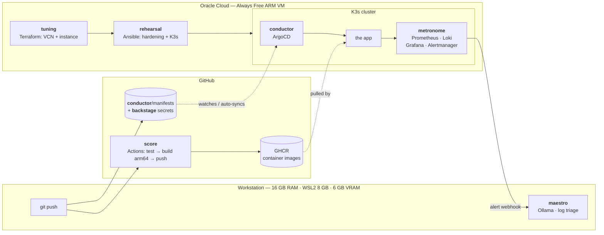

# ensemble

A personal Internal Developer Platform. Seven tools wired into one path that
runs from *nothing exists* to *the change I merged is running in production,
being watched, and explaining its own failures in plain English*.

An ensemble tunes its instruments, rehearses until it's reliable, follows the
score, lets the conductor keep everyone synchronized without anyone waving for
attention, guards what's valuable backstage, keeps steady time with the
metronome, and has a maestro who catches what's off before anyone else does.
Each of those is a layer, and the mapping is exact:

| # | Layer | Tool | What it does |
|---|-------|------|--------------|
| 1 | [**tuning**](tuning/) | Terraform | Provisions the compute — an Oracle Cloud Always Free ARM VM |
| 2 | [**rehearsal**](rehearsal/) | Ansible | Hardens and configures that VM into a ready state |
| 3 | [**score**](score/) | GitHub Actions | CI — builds, tests, and pushes a container image |
| 4 | [**conductor**](conductor/) | ArgoCD | GitOps — watches the manifests and syncs the cluster, unattended |
| 5 | [**backstage**](backstage/) | SOPS + age | Encrypted secrets, safe to commit to Git |
| 6 | [**metronome**](metronome/) | Prometheus · Grafana · Loki · Alertmanager | Observability |
| 7 | [**maestro**](maestro/) | Ollama (local) | AIOps — reads logs and alerts, drafts plain-English cause notes |

## Build status

Built one layer at a time, and demoable at every stage rather than only at the
end.

Layer 4 landed before layer 3 because it didn't depend on it: ArgoCD needed the
cluster layer 2 produced, while `score` needed nothing but a repo. The seam
between them is a single image reference, which `score` now writes.

- [x] **1 · tuning** — VCN, gateway, routing, security list, subnet, A1 instance. Free-tier limits enforced in code.
- [x] **2 · rehearsal** — seven idempotent roles: base prep, operator account, firewall, hardening, Docker, K3s, verification.
- [x] **3 · score** — a Go service with zero dependencies, and a pipeline that cross-compiles arm64 without emulation, attests provenance, and hands the digest to layer 4.
- [x] **4 · conductor** — ArgoCD on the cluster, a root app-of-apps watching `conductor/manifests/`, self-healing and pruning.
- [x] **5 · backstage** — SOPS + age secrets committed to this public repo, decrypted by ArgoCD at sync, and actually consumed by the app.
- [x] **6 · metronome** — Prometheus, Grafana, Loki, Alertmanager and Alloy, cut down to fit 420m CPU and 1.3 GB, with one alert that means something.
- [x] **7 · maestro** — a local model that reads an alert and drafts the note, with no cluster credentials and nothing depending on it being up.

### Status

All seven layers are written, reviewed and version-controlled. **The cluster
they target has not been provisioned yet**, and I'd rather say that plainly than
let a row of ticks imply otherwise.

What has actually run:

- **`score` is green on GitHub** — [the pipeline
  executes](https://github.com/iagorp6/ensemble/actions), tests pass, and it
  publishes a real multi-architecture image to GHCR (`linux/amd64` +
  `linux/arm64` from one x86 runner, no QEMU) with a verifiable provenance
  attestation. `cue` has written three image digests back into
  `conductor/manifests/` on its own.
- **`maestro`'s 22 tests pass**, and **`score`'s 26**.
- **`backstage` does a real SOPS round trip** — encrypt, decrypt, denied
  without the key, MAC failure on a tampered byte.

What has *not*:

- No OCI instance exists, so `tuning` and `rehearsal` are unrun.
- ArgoCD has never synced, so `conductor`, `backstage`'s decrypt-at-sync path
  and all of `metronome` are verified only by rendering the real charts and
  asserting against the output — schema-valid and resource-budgeted, not
  observed working.
- No model has been called with a real alert.

Every layer's README ends with what was verified and what wasn't, in those
terms. Lint-clean and schema-valid is not the same as green, and a portfolio
repo that blurs the two is worth less than one that doesn't.

---

## Why this exists

I hold an Alura Platform Engineering certification with no project evidence
behind it. That's the gap this closes.

The broader point is that "platform engineering" isn't any one of these tools.
It's the seam between them — the thing that turns seven separate CLIs into one
path a developer can walk without asking anyone for help. Individually I can
show a Terraform lab, a CI pipeline, a reliability project. What I couldn't
show, before this, is the wiring: that `tuning`'s outputs are `rehearsal`'s
inputs, that `score` deliberately has no cluster credentials because
`conductor` is the only thing allowed to deploy, that `metronome`'s alerts are
what `maestro` reads.

Each layer's own README explains its concepts from first principles, because
the goal was understanding every piece well enough to re-explain it, not
having working code.

---

## Architecture



Full walkthrough in [docs/architecture.md](docs/architecture.md).

### The hosting split, and why it's deliberate

The cluster runs in Oracle Cloud, CI runs on GitHub, and the AI layer runs
locally. Three places, chosen rather than settled for.

The workstation this is operated from has **16 GB RAM, 8 GB of it available to
WSL2, and 6 GB of VRAM**. K3s plus ArgoCD plus a full Prometheus/Grafana/Loki
stack would fit in that, barely, and would leave nothing for an editor, a
browser and a language model. The obvious response is to scale the project down
— drop Loki, skip ArgoCD, run three layers instead of seven. I'd rather place
each layer where it actually belongs:

- **The cluster** (`tuning` → `rehearsal` → K3s → `conductor` → `metronome`)
  runs on an **Oracle Cloud Always Free** VM. It's free, it's always on, which
  is the only honest way to demo GitOps and alerting, and it doubles as OCI
  practice while I'm mid-certification on OCI Foundations Associate.
- **`score`** runs on **GitHub-hosted runners**. CI that only runs while a
  workstation is powered on isn't CI, and it costs nothing either way.
- **`maestro`** runs **locally**. It's the one component that genuinely wants
  the 6 GB of VRAM, and log triage is exactly the workload where sending data
  to a hosted model is the wrong instinct.

Deciding where each component should live given real constraints is most of
what platform work actually is. Documenting the reasoning is the part that
makes it a decision rather than a limitation.

The constraint has teeth, too. The free tier covers 2 OCPUs and 12 GB of RAM
running continuously — [not the 4 and 24 that gets repeated
everywhere](tuning/README.md#the-always-free-maths--the-thing-worth-knowing) —
and the whole observability stack has to fit inside that. Tuning Prometheus and
Loki to a real budget is a more useful thing to have practised than running
them at chart defaults on a machine that never fills up.

---

## Getting started

Each layer stands alone and has its own README with prerequisites, concepts and
runbook. Start at the beginning:

**1 → [tuning](tuning/README.md)** — Terraform, OCI credentials, and the VM.
**2 → [rehearsal](rehearsal/README.md)** — Ansible, hardening, and the K3s cluster.
**3 → [score](score/README.md)** — the app, and CI that cross-compiles for ARM.
**4 → [conductor](conductor/README.md)** — ArgoCD, and the GitOps loop.
**5 → [backstage](backstage/README.md)** — SOPS + age, and secrets in a public repo.
**6 → [metronome](metronome/README.md)** — observability, sized to what's left.
**7 → [maestro](maestro/README.md)** — a local model that reads the alerts.

You'll need a free [Oracle Cloud](https://www.oracle.com/cloud/free/) account.
Everything in this repo is designed to stay inside the Always Free tier, and
layer 1 enforces that in code rather than trusting me to remember.

Run it from WSL or Linux — Ansible has no supported Windows control node, so
there's one toolchain rather than two.

### From nothing to a running platform

The whole sequence, so the shape is visible without reading seven READMEs
first. Each step's own README has the prerequisites and the reasoning.

```bash
# 1. tuning — provision the VM  (~5 min, plus retries if A1 capacity is short)
cd tuning
cp terraform.tfvars.example terraform.tfvars   # set tenancy_ocid
terraform init && terraform apply
terraform output -raw ansible_inventory > ../rehearsal/inventory.ini
```

```bash
# 2. rehearsal — harden it and install K3s  (~8 min)
cd ../rehearsal
ansible-galaxy collection install -r requirements.yml
ansible-playbook playbook.yml
ansible-playbook playbook.yml          # proves it: changed=0
export KUBECONFIG=$PWD/kubeconfig.podium
```

```bash
# 3. backstage — give the cluster the decryption key  (before conductor, so the
#    first sync can already decrypt)
cd ../backstage
age-keygen -o age.key                  # then update .sops.yaml + sops updatekeys
./install-key.sh
```

```bash
# 4. conductor — the one imperative step in the platform
cd ../conductor/bootstrap
./install.sh
```

Everything after that arrives by Git. `downbeat` picks up `overture`,
`backstage`'s secrets and all four `metronome` Applications on its own, in sync
wave order. Watch it:

```bash
kubectl -n argocd get applications -w
```

```bash
# 5. maestro — on the workstation, not the cluster
cd ../../maestro
ollama pull llama3.2:3b
cp .env.example .env && set -a && . ./.env && set +a
./triage.py serve
# in another terminal, so Alertmanager can reach it:
ssh -R 0.0.0.0:9099:localhost:9099 stagehand@<node>
```

`score` needs nothing — it runs on push, and its first successful run replaces
`overture`'s placeholder image with one it built.

**Teardown** is `terraform destroy` in `tuning/`. Because
`preserve_boot_volume = false`, the 100 GB boot volume goes with the instance
rather than sitting in the free-tier storage grant.

---

## Ground rules I set for myself

- **Comment the *why*, not the *what*.** `# create a VCN` above a VCN is noise.
  Why this route table is a dedicated resource instead of an edit to the
  default one is worth a paragraph, because the reason (destroy-time
  behaviour) isn't visible from the code.
- **Guardrails in code.** Anything that could cost money or lock me out should
  fail at plan time with a sentence explaining itself, not sit in documentation.
- **Every layer demoable on its own.** Seven layers is a lot to hold; if layer 4
  only makes sense after layer 6 exists, the boundaries are wrong.
- **No employer data, branding or assets anywhere.** Entirely personal work.

## What I'd add next

Parked deliberately — seven layers is already the scope, and the discipline of
not adding an eighth tool mid-build is part of the exercise.

- **Backstage.io or Port** as an actual developer portal UI. The irony that
  layer 5 is called `backstage` for unrelated reasons is not lost on me.
- **A golden path template** — `ensemble new-service <name>` scaffolding a repo
  with the CI, manifests and dashboards already wired. This is the thing that
  turns a platform from "infrastructure I built" into "infrastructure other
  people can use."
- **Policy as code** (OPA/Gatekeeper or Kyverno) so cluster rules are enforced
  rather than documented.
- **Renovate** for automated dependency PRs, which is where the GitOps loop
  starts paying for itself.
- **A second node**, to make `conductor` schedule across a real cluster instead
  of a single-node one. Blocked on the free tier, not on interest.
- **A repo-wide validation workflow.** Every layer's README ends with what was
  verified — `terraform validate`, `actionlint` with shellcheck, `hadolint`,
  `kubeconform` against real CRD schemas, chart renders asserted against. All of
  that was run by hand, once. A second GitHub Actions workflow running it on
  every pull request would turn "I checked" into "it is checked", and it needs
  no new tool — only the one layer 3 already uses. This is the first thing I'd
  build next, and the only reason it isn't here is the no-scope-creep rule.

The rule I set myself was to note these rather than build them. Keeping to it
while the list grew was harder than adding any single item on it would have
been, which is roughly the point.

## Related

- [radio-auto-pi](https://github.com/iagorp6/radio-auto-pi) — a self-recovering
  Raspberry Pi radio kiosk. Same thread: making systems that put themselves
  back together without a person in the room.

## License

[MIT](LICENSE)
