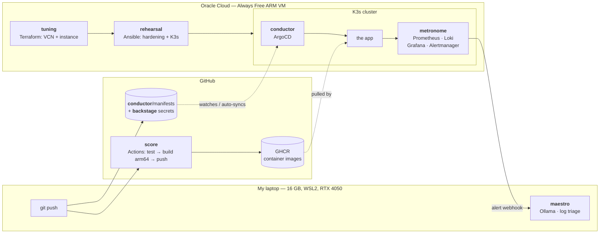

# ensemble

A personal Internal Developer Platform. Seven tools wired into one path that
runs from *nothing exists* to *the change I merged is running in production,
being watched, and explaining its own failures in plain English*.

An ensemble tunes its instruments, rehearses until it's reliable, follows the
score, lets the conductor keep everyone synchronized without anyone waving for
attention, guards what's valuable backstage, keeps steady time with the
metronome, and has a maestro who catches what's off before anyone else does.
Each of those is a layer, and the mapping is exact:

| # | Layer | Tool | What it does |
|---|-------|------|--------------|
| 1 | [**tuning**](tuning/) | Terraform | Provisions the compute — an Oracle Cloud Always Free ARM VM |
| 2 | [**rehearsal**](rehearsal/) | Ansible | Hardens and configures that VM into a ready state |
| 3 | **score** | GitHub Actions | CI — builds, tests, and pushes a container image |
| 4 | **conductor** | ArgoCD | GitOps — watches the manifests and syncs the cluster, unattended |
| 5 | **backstage** | SOPS + age | Encrypted secrets, safe to commit to Git |
| 6 | **metronome** | Prometheus · Grafana · Loki · Alertmanager | Observability |
| 7 | **maestro** | Ollama (local) | AIOps — reads logs and alerts, drafts plain-English cause notes |

## Build status

Built one layer at a time, and demoable at every stage rather than only at the
end.

- [x] **1 · tuning** — VCN, gateway, routing, security list, subnet, A1 instance. Free-tier limits enforced in code.
- [x] **2 · rehearsal** — seven idempotent roles: base prep, operator account, firewall, hardening, Docker, K3s, verification.
- [ ] **3 · score**
- [ ] **4 · conductor**
- [ ] **5 · backstage**
- [ ] **6 · metronome**
- [ ] **7 · maestro**

---

## Why this exists

I hold an Alura Platform Engineering certification with no project evidence
behind it. That's the gap this closes.

The broader point is that "platform engineering" isn't any one of these tools.
It's the seam between them — the thing that turns seven separate CLIs into one
path a developer can walk without asking anyone for help. Individually I can
show a Terraform lab, a CI pipeline, a reliability project. What I couldn't
show, before this, is the wiring: that `tuning`'s outputs are `rehearsal`'s
inputs, that `score` deliberately has no cluster credentials because
`conductor` is the only thing allowed to deploy, that `metronome`'s alerts are
what `maestro` reads.

Each layer's own README explains its concepts from first principles, because
the goal was understanding every piece well enough to re-explain it, not
having working code.

---

## Architecture

Full walkthrough in [docs/architecture.md](docs/architecture.md).

### The hosting split, and why it's deliberate

The cluster runs in Oracle Cloud, CI runs on GitHub, and the AI layer runs on
my laptop. Three places, chosen rather than settled for.

I'm on a 16 GB laptop with WSL2 capped at 8 GB and 8 threads. K3s plus ArgoCD
plus a full Prometheus/Grafana/Loki stack would fit in that, barely, and would
leave nothing for an editor, a browser and a language model. The obvious
response is to scale the project down — drop Loki, skip ArgoCD, run three
layers instead of seven. I'd rather place each layer where it actually belongs:

- **The cluster** (`tuning` → `rehearsal` → K3s → `conductor` → `metronome`)
  runs on an **Oracle Cloud Always Free** VM. It's free, it's always on, which
  is the only honest way to demo GitOps and alerting, and it doubles as OCI
  practice while I'm mid-certification on OCI Foundations Associate.
- **`score`** runs on **GitHub-hosted runners**. CI that only runs when my
  laptop is open isn't CI, and it costs nothing either way.
- **`maestro`** runs **locally**. It's the one component that genuinely wants
  the RTX 4050's VRAM, and log triage is exactly the workload where sending
  data to a hosted model is the wrong instinct.

Deciding where each component should live given real constraints is most of
what platform work actually is. Documenting the reasoning is the part that
makes it a decision rather than a limitation.

The constraint has teeth, too. The free tier covers 2 OCPUs and 12 GB of RAM
running continuously — [not the 4 and 24 that gets repeated
everywhere](tuning/README.md#the-always-free-maths--the-thing-worth-knowing) —
and the whole observability stack has to fit inside that. Tuning Prometheus and
Loki to a real budget is a more useful thing to have practised than running
them at chart defaults on a machine that never fills up.

---

## Getting started

Each layer stands alone and has its own README with prerequisites, concepts and
runbook. Start at the beginning:

**1 → [tuning](tuning/README.md)** — Terraform, OCI credentials, and the VM.
**2 → [rehearsal](rehearsal/README.md)** — Ansible, hardening, and the K3s cluster.

You'll need a free [Oracle Cloud](https://www.oracle.com/cloud/free/) account.
Everything in this repo is designed to stay inside the Always Free tier, and
layer 1 enforces that in code rather than trusting me to remember.

Both layers run from WSL — Ansible has no supported Windows control node, so
there's one toolchain rather than two.

---

## Ground rules I set for myself

- **Comment the *why*, not the *what*.** `# create a VCN` above a VCN is noise.
  Why this route table is a dedicated resource instead of an edit to the
  default one is worth a paragraph, because the reason (destroy-time
  behaviour) isn't visible from the code.
- **Guardrails in code.** Anything that could cost money or lock me out should
  fail at plan time with a sentence explaining itself, not sit in documentation.
- **Every layer demoable on its own.** Seven layers is a lot to hold; if layer 4
  only makes sense after layer 6 exists, the boundaries are wrong.
- **No employer data, branding or assets anywhere.** Entirely personal work.

## What I'd add next

Parked deliberately — seven layers is already the scope, and the discipline of
not adding an eighth tool mid-build is part of the exercise.

- **Backstage.io or Port** as an actual developer portal UI. The irony that
  layer 5 is called `backstage` for unrelated reasons is not lost on me.
- **A golden path template** — `ensemble new-service <name>` scaffolding a repo
  with the CI, manifests and dashboards already wired. This is the thing that
  turns a platform from "infrastructure I built" into "infrastructure other
  people can use."
- **Policy as code** (OPA/Gatekeeper or Kyverno) so cluster rules are enforced
  rather than documented.
- **Renovate** for automated dependency PRs, which is where the GitOps loop
  starts paying for itself.
- **A second node**, to make `conductor` schedule across a real cluster instead
  of a single-node one. Blocked on the free tier, not on interest.

## Related

- [radio-auto-pi](https://github.com/iagorp6/radio-auto-pi) — a self-recovering
  Raspberry Pi radio kiosk. Same thread: making systems that put themselves
  back together without a person in the room.

## License

[MIT](LICENSE)
