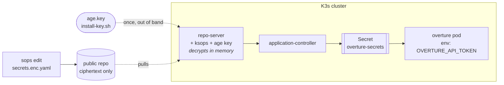

# `backstage` — secrets you can commit

> *What's valuable is kept backstage, not carried through the auditorium.*

Layer 5 of [ensemble](../README.md). SOPS-encrypted secrets committed to a
**public** repository, decrypted by ArgoCD at sync time, and consumed by the
running application.

---

## The problem, stated precisely

Layer 4 made Git the only way to change the cluster. That works for every kind
of manifest except one.

A Kubernetes `Secret` is **not encrypted**. It's base64. `kubectl get secret -o
yaml | base64 -d` isn't an attack, it's the documented way to read one. So a
Secret committed to Git is a plaintext credential with an extra step — and this
repository is public.

That left exactly one piece of cluster state undescribed by Git, which is a hole
in the claim the whole platform rests on. This layer closes it.

## Why SOPS specifically

Most tools encrypt a file into an opaque blob. SOPS encrypts the **values** and
leaves the **keys and structure** readable:

```yaml
apiVersion: v1
kind: Secret
metadata:
    name: overture-secrets
    namespace: overture
stringData:
    OVERTURE_API_TOKEN: ENC[AES256_GCM,data:vhUIliXpJOwD…,type:str]
```

That's not cosmetic:

- **`git diff` stays useful.** A reviewer sees *that* the token was rotated and
  *which* key changed, without being able to read either version. A blob shows
  "binary file changed".
- **Merge conflicts stay tractable.** Adding a key is a one-line diff.
- **Kubernetes can still route it.** `apiVersion`, `kind` and `metadata` are
  readable, which is what lets an encrypted Secret sit in a GitOps directory at
  all. Encrypt those too — the default if you don't set `encrypted_regex` — and
  you get a perfectly secret, completely useless file.

And **age** rather than GPG: one line for a public key, one for a private, no
keyring, no trust model, no expiry dates, no `gpg-agent` failing on a fresh
machine. GPG's flexibility is exactly what makes it hard to onboard someone
onto.

---

## How a secret reaches the application



The plaintext exists in exactly one place: the repo-server's memory, for the
duration of one render. Never on disk, never in CI, never in a terminal.

## Proving it worked — without printing it

Encrypting a value nothing reads proves only that the encrypt command ran. So
`overture` actually consumes this secret:

```bash
curl -s http://<node-ip>/ | jq .tokenConfigured
# true   ← the secret arrived

curl -s http://<node-ip>/private
# 401

curl -s http://<node-ip>/private -H "Authorization: Bearer $(sops decrypt backstage/secrets.enc.yaml | yq .stringData.OVERTURE_API_TOKEN)"
# {"message":"authenticated — the backstage secret made it all the way here"}
```

The service reports the **fact** of delivery and gates a real endpoint on the
**value**. It never echoes it — and
`TestTokenNeverAppearsInAnyResponse` in [score](../score/main_test.go) sweeps
every endpoint, authenticated and not, asserting the token appears in no body
and no header. That's the kind of leak that arrives by accident in a debug
field, so it's worth a test rather than a habit.

The comparison is also constant-time and hashed first — `crypto/subtle` so
response timing doesn't reveal how many leading bytes were right, and SHA-256
first so the length doesn't leak either.

---

## Setup

### 1. Install the tools

```bash
curl -sSL -o /tmp/sops https://github.com/getsops/sops/releases/download/v3.13.3/sops-v3.13.3.linux.arm64
sudo install -m 0755 /tmp/sops /usr/local/bin/sops
sudo apt install -y age
```

(Use `linux.amd64` on an x86 laptop. WSL on most machines is amd64.)

### 2. Generate your own key

**Do this before anything real goes in.** The key currently in
[`.sops.yaml`](.sops.yaml) is a throwaway I generated while building this layer,
so the committed `secrets.enc.yaml` would be a real encrypted file rather than a
hand-written imitation. It protects one placeholder value.

```bash
age-keygen -o backstage/age.key
age-keygen -y backstage/age.key          # your public recipient
```

`backstage/age.key` is gitignored (`*.key`). Verify that before you continue:

```bash
git check-ignore -v backstage/age.key
```

### 3. Point `.sops.yaml` at your key and re-encrypt

Replace the `age:` recipient with your public key, then:

```bash
cd backstage
export SOPS_AGE_KEY_FILE=$PWD/age.key
sops updatekeys secrets.enc.yaml     # re-encrypt to the new recipient list
```

`updatekeys` re-encrypts the data key for the new recipients **without ever
decrypting the file to disk**.

### 4. Set a real value

```bash
sops edit secrets.enc.yaml
```

Decrypts into your editor, in memory, re-encrypts on save. The plaintext never
becomes a file a stray `git add -A` could catch. Never `sops -d > file`, edit,
and re-encrypt — that's the workflow that leaks.

### 5. Give the cluster the key

```bash
./install-key.sh
```

Creates `argocd/sops-age-key` and restarts the repo-server. This is the one
thing that can't come from Git, for the obvious reason.

---

## Adding a teammate

This is the part the tooling is actually chosen for.

1. They run `age-keygen -o ~/.config/sops/age/keys.txt` and send you the
   **public** line — over Slack, in a PR, on a postcard. It's public.
2. You add it to `.sops.yaml` under `age:`, one per line.
3. `sops updatekeys secrets.enc.yaml`
4. Commit. They can now decrypt everything.

**The private key never moves.** Nobody shares a password, nothing sensitive is
transmitted, and there's no shared vault credential that has to be rotated when
someone leaves.

Removing access is the same in reverse — delete their line, `updatekeys`,
commit. Note that this stops them decrypting *future* values only; anything they
already read is already read, so removal must be followed by rotation. That's
true of every secret system and is worth saying out loud rather than implying
that a Git commit revokes knowledge.

## Rotating

```bash
cd backstage
sops edit secrets.enc.yaml            # set new values
git commit -am "backstage: rotate the overture API token"
git push
```

ArgoCD reconciles, the Secret updates. Note pods do **not** automatically
restart on a Secret change when it's injected as an environment variable — env
is read once at process start. Either restart the deployment, or mount secrets
as files (which kubelet does update in place) if live rotation matters.

Rotating the *age key itself* is `age-keygen` → update `.sops.yaml` →
`sops updatekeys` → `./install-key.sh` → commit.

---

## What this does and doesn't protect

Worth being precise, because "we encrypt our secrets" is often claimed more
broadly than it's true.

**Protected:** the value in Git. Cloning this public repo, reading its history,
or finding it in a search index gives you ciphertext. Git history is not a
problem here — every historical version is also encrypted.

**Not protected:**

- **Anyone with cluster access.** The decrypted Secret is an ordinary Kubernetes
  Secret. `kubectl get secret -o yaml` works for anyone with RBAC to read it.
  This layer moves the secret safely *through Git*; it does not harden the
  cluster. K3s `--secrets-encryption` (set in layer 2) covers encryption at rest
  in the datastore, which is a different threat again.
- **The repo-server pod.** It holds the age key and does the decrypting. It is
  the highest-value target on this platform, which is why `--enable-exec` gets a
  long comment in [values.yaml](../conductor/bootstrap/values.yaml) rather than
  a shrug.
- **Metadata.** `.sops.yaml` publishes the recipient list, and the encrypted file
  publishes key *names*. Anyone can see this cluster has a secret called
  `OVERTURE_API_TOKEN` and how many people can read it. That's usually fine and
  occasionally isn't.
- **Anything already leaked.** Encryption isn't rotation.

**What I'd add with a team:** the age key in a cloud KMS instead of a file —
SOPS supports OCI KMS, and the trust root becomes an IAM role rather than
something a person holds. That's the version where "who has the key" is
answerable from an audit log.

---

## Files

| File | Committed? | What it is |
|---|---|---|
| `.sops.yaml` | yes | Which files get encrypted, to which recipients, and which fields |
| `secrets.enc.yaml` | yes | The encrypted Secret. Safe in a public repo |
| `secrets.example.yaml` | yes | Plaintext template, placeholder values only |
| `kustomization.yaml` | yes | Makes this a Kustomize app so ksops can run |
| `secret-generator.yaml` | yes | Tells kustomize to decrypt via ksops |
| `install-key.sh` | yes | Loads the private key into the cluster |
| `age.key` | **no** | The private key. Gitignored via `*.key` |

---

## Verified

Real tooling, real round trip — sops 3.13.3 and age 1.3.1:

- Encrypted with `encrypted_regex: ^(data|stringData)$`; metadata stayed
  readable, the value became `ENC[AES256_GCM,…]`
- Decrypt with the key returns the original value
- Decrypt **without** the key fails: *"at least one key has to be successful,
  but none were"*
- Flipping one byte of ciphertext fails the MAC: *"cipher: message
  authentication failed"* — so tampering is detected, not silently applied
- 26 Go tests pass, including the endpoint sweep asserting the token leaks into
  no response

**Not verified:** the ArgoCD side. The ksops init container, the `--enable-exec`
kustomize build, and the decrypt-at-sync path all need a running cluster. The
image tag was checked against the registry (`viaductoss/ksops:v4.5.1` is
genuinely multi-arch — the `-arm64`-suffixed tag looks like the right choice on
an Ampere node and is the wrong one, being single-arch), but the wiring itself
is unrun.
