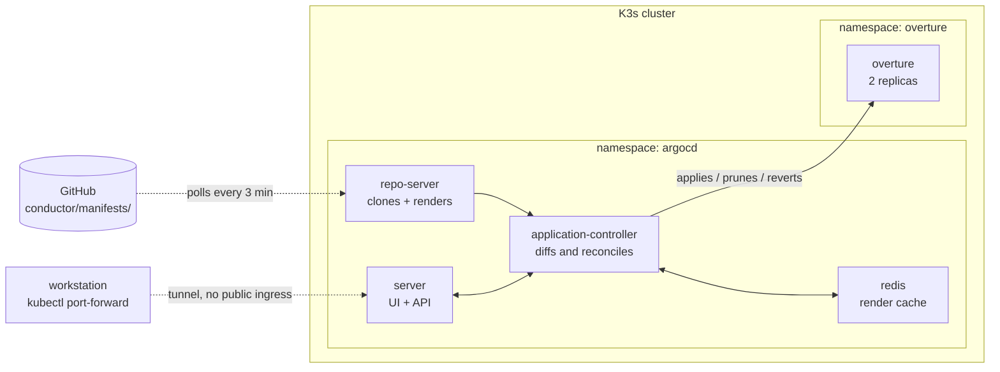

# `conductor` — deploying by merging

> *A conductor keeps everyone synchronized without anyone waving for attention.*

Layer 4 of [ensemble](../README.md). Installs ArgoCD onto the K3s cluster from
layer 2 and points it at [`conductor/manifests/`](manifests/) in this
repository.

After this layer, **the only way to change what runs on the cluster is to
change Git.**

---

## The idea this layer is here to prove

GitOps is *"deploy by merging to Git"*, not *"deploy by running a script."*

The distinction sounds like branding until you look at what it changes:

|  | Push (CI runs `kubectl apply`) | Pull (ArgoCD reconciles) |
|---|---|---|
| Who holds cluster credentials | CI | Nobody outside the cluster |
| "What's running right now?" | Read job logs | `git log` |
| Rollback | Re-run an old pipeline | `git revert` |
| Manual `kubectl edit` | Persists silently until the next deploy | Reverted within seconds |
| Deploy without a commit | Possible | Not possible |

The last row is the whole thing. When the only path into the cluster is a
commit, every change gets an author, a timestamp, a diff, and a review point —
for free, because there is no other way to do it.

---

## `score` builds. `conductor` deploys. They never meet.

This is the most load-bearing separation in the repo, and it's the reason
ArgoCD is a layer rather than a line in a workflow file.

The tempting design is one pipeline: CI builds the image, then runs
`kubectl apply`. Fewer moving parts, and plenty of teams do it. It's wrong for
three reasons that only surface later:

**1. CI would need cluster credentials.** A `KUBECONFIG` secret in GitHub
Actions means anyone who can merge a workflow change can run arbitrary commands
against production. Workflow files live in the same repo as application code
and are edited far more casually than infrastructure. The blast radius of a
compromised CI token becomes the entire cluster.

Here, `score` has registry credentials and no cluster credentials. It can push
an image. It cannot deploy one.

**2. The cluster's real state stops being knowable.** With `kubectl apply` from
CI, what's running is the accumulated residue of every pipeline that ever ran —
including the one someone re-ran from a stale branch in 2024. Answering "what's
deployed?" means archaeology through job logs. Here it's `git log` on one
directory.

**3. Rollback stops being a first-class operation.** Re-running an old pipeline
rebuilds an old commit against *today's* base images and *today's* transitive
dependencies. You get something new that resembles the thing that worked.
Reverting a commit and letting ArgoCD reconcile restores the exact previously
running state, because the manifest pins an exact image digest.

So the interface between the two layers is one line in
[`manifests/overture/deployment.yaml`](manifests/overture/deployment.yaml) — an
image tag. `score` produces images; `conductor` decides which one runs. Neither
can do the other's job, which is the point.

---

## What gets installed



Note the direction of every arrow touching the cluster: **inward, initiated
from inside.** Nothing outside pushes in. That's what "pull-based" means
structurally, and it's why no credential capable of changing this cluster
exists anywhere else after bootstrap.

### Components turned off

| Component | State | Why |
|---|---|---|
| `dex` | **off** | SSO broker. One operator, no identity provider to federate with — ~100 MB translating logins that never happen. First thing to turn back on if a second person appears. |
| `notifications` | **off** | Sends sync results to Slack/email. Nothing to notify. Layer 7 consumes *alerts* from Alertmanager, not sync events. |
| `applicationSet` | **on** | Not optional — chart 10.x removed the `enabled` key entirely. Sized small instead. |

That last row is worth a note: `applicationSet.enabled: false` looks like it
should work, appears in older tutorials, and is **silently ignored** by this
chart version. A value that doesn't exist isn't an error in Helm — it's just
nothing. Which is the most annoying class of configuration bug there is.

---

## Decisions worth defending

### No public ingress for the ArgoCD UI

Layer 1 opened 80/443 to the world for the application. ArgoCD is deliberately
not on them.

The ArgoCD API server can create, modify and delete anything in the cluster.
Putting its UI on the public internet makes it the highest-value target on the
platform, protected by one password. Reaching it through a tunnel costs one
command and removes the exposure entirely:

```bash
kubectl port-forward svc/argocd-server -n argocd 8080:80
```

`lockup` (layer 2) kept `AllowTcpForwarding` on in sshd for exactly this. If you
later want it on a hostname, the honest prerequisites are TLS and an identity
provider — which means turning dex back on, not just flipping `ingress.enabled`.

### `server.insecure: true` is not what it sounds like

It stops argocd-server terminating TLS *itself*. TLS gets terminated at the
edge — by Traefik, or by the SSH tunnel above — and the internal hop is plain
HTTP inside the cluster network.

The alternative is a proxy speaking HTTPS to a backend with a self-signed
certificate, which produces a 502 that looks exactly like the backend being
down. One TLS terminator, at the boundary, is both simpler and more debuggable.

### CPU requests, no CPU limits

Every component sets CPU *requests* and memory *requests and limits*, and no
CPU limit anywhere. This is deliberate:

- A CPU **request** is a scheduling guarantee and a share weight under
  contention.
- A CPU **limit** is a hard throttle enforced by the kernel's CFS quota, and it
  applies *even when the node is idle*. A pod limited to 200m gets throttled at
  200m whether the other 1800m are busy or completely free. On two cores that
  converts spare capacity into latency for nothing.
- **Memory is different.** It's incompressible — a process that wants more RAM
  than exists can't be slowed down, only killed. So memory gets a hard limit,
  and that limit is what stops one component OOM-killing the node.

Total requests are ~600m CPU and ~1 GB RAM, leaving the bulk of 2 OCPU / 12 GB
for the application and for layer 6.

### `keep: true` on the CRDs

`helm uninstall` would otherwise delete the `Application` CRD, which deletes
every Application object, whose finalizers then delete every deployed workload
on the way out. Uninstalling the deployment tool would take production with it.

With `keep: true`, removing ArgoCD removes ArgoCD.

### An explicit branch, not `HEAD`

`targetRevision: HEAD` follows the repo's default branch wherever it points.
That's fine right up until the default branch changes and the cluster follows
it without anyone deciding to. `main` is written out.

This is also where release discipline would go: pointing at a tag makes the
deploy "move the tag" — still a Git operation, still with an author and a diff.

---

## Running it

### Prerequisites

`kubectl` and `helm` on the control machine, plus the kubeconfig layer 2
fetched:

```bash
sudo snap install kubectl --classic
curl -fsSL https://raw.githubusercontent.com/helm/helm/main/scripts/get-helm-3 | bash
export KUBECONFIG=$PWD/rehearsal/kubeconfig.podium
kubectl get nodes
```

### Bootstrap

```bash
cd conductor/bootstrap
./install.sh
```

This is **the one imperative step in the entire platform**, and it's worth
being honest about why it exists rather than hiding it in a README bullet:
something has to install the thing that watches Git, and that something cannot
itself be GitOps. Every GitOps setup has this seam. Most don't write it down.

It's idempotent — re-running it is also how you apply a change to
`bootstrap/values.yaml`.

### Prove the loop

The demonstration that matters. Drift the cluster by hand and watch it heal:

```bash
kubectl scale deploy/overture -n overture --replicas=5
kubectl get deploy/overture -n overture -w
```

Replicas go to 5, then back to 2, because 2 is what Git says. The cluster isn't
a place where state is authored — it's a projection of the repository.

Then do it the real way:

```bash
# edit replicas in conductor/manifests/overture/deployment.yaml
git commit -am "Scale overture to 3" && git push
```

No kubectl, no pipeline. Within about three minutes the cluster matches.

### Look at it

```bash
kubectl port-forward svc/argocd-server -n argocd 8080:80
# http://localhost:8080 — the password is printed by install.sh

kubectl -n argocd get applications
curl http://<node-ip>/
```

---

## About the demo app

`overture` currently runs `ghcr.io/stefanprodan/podinfo:6.14.1` — a placeholder.
Layer 3 (`score`) builds a real application and changes exactly one line, the
image reference.

podinfo rather than nginx because it earns its place across two layers: it
publishes a Prometheus `/metrics` endpoint, which is what `metronome` (layer 6)
needs something to scrape. A simpler placeholder would have to be replaced
twice.

Its arm64 support was verified against the registry's manifest index rather than
assumed — the constraint layer 1 propagated by choosing an Ampere shape, and the
single most likely cause of a pod crash-looping on this platform.

---

## When it fails

### `Application downbeat` is `Unknown` / `ComparisonError`

ArgoCD can't read the repository. For a public repo this is usually egress:
check the node can reach github.com. For a private one, it needs credentials —
`argocd repo add`, or a `Secret` once layer 5 exists.

### Everything is `OutOfSync` and syncing does nothing

Almost always the `path` in `application.yaml` doesn't match reality — a typo
gives an empty directory, and an empty directory with `prune: true` means
"delete everything". `allowEmpty: false` is set precisely to make that fail
loudly instead.

### Pods are `CrashLoopBackOff` with `exec format error`

An amd64 image on an arm64 node. The constraint from layer 1. Check with:

```bash
docker manifest inspect <image> | grep architecture
```

### Pods are `Pending` with `Insufficient cpu`

Requests across ArgoCD, the app and (later) the observability stack exceed two
cores. The fix is lowering requests, not raising limits — requests are what the
scheduler reserves.

### `kubectl port-forward` connects but the UI won't load

`server.insecure: true` means argocd-server speaks HTTP. Use
`http://localhost:8080`, not `https://`.

---

## What this hands to the rest of the platform

- **Layer 3 (`score`)** — a deployment whose image tag is the only thing it
  needs to change, and a guarantee that it never needs cluster credentials.
- **Layer 5 (`backstage`)** — the gap this layer leaves open. Secrets can't be
  committed here yet, so they're the one piece of cluster state not described in
  Git. That's what SOPS closes.
- **Layer 6 (`metronome`)** — an app-of-apps root that will deploy the
  observability stack from one committed file, and an app already annotated for
  Prometheus scraping.
