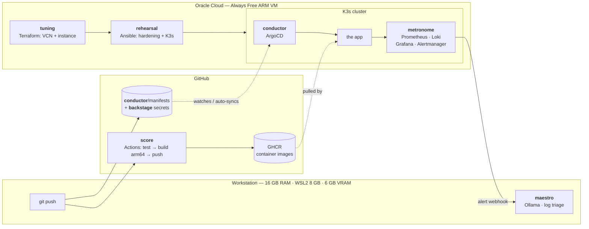
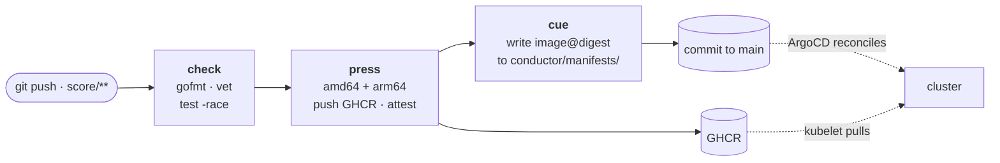
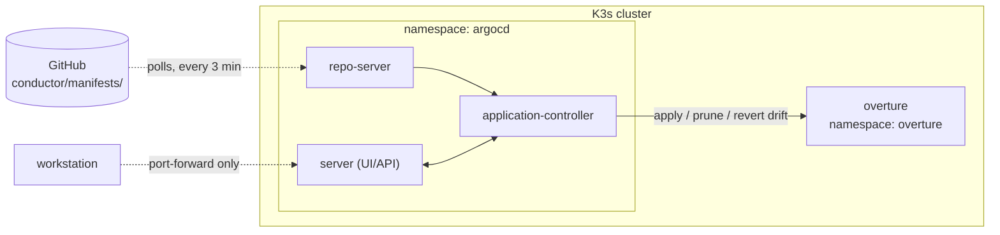
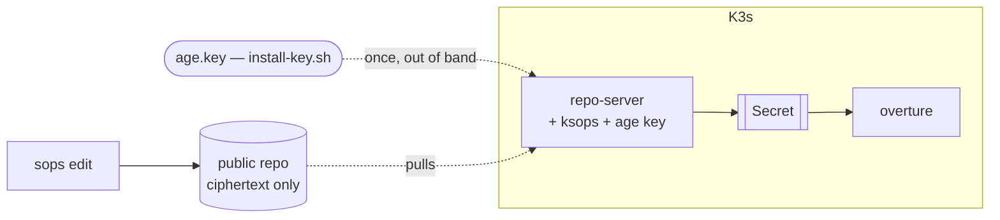

# Architecture

The long version. The [README](../README.md) is the tour; this is where the
decisions get argued rather than stated.

Written incrementally — each layer gets its section as it's built, so this file
tracks the real state of the repo rather than an aspirational one.

**Built so far:** layers 1–6. Only `maestro` (layer 7) remains.

---

## The one idea underneath everything: nobody touches the machine

Every boundary in this repo comes from one rule. **No layer changes the state of
the system by having a human run something against it.** A layer describes what
should be true and something else makes it true.

- `tuning` doesn't create a VM. It describes a VM that exists, and Terraform
  reconciles.
- `rehearsal` doesn't install packages. It asserts packages are present, and
  Ansible does nothing if they already are.
- `conductor` doesn't deploy. It watches a Git directory and makes the cluster
  match it.

That's the same property three times, and it's why the tools compose. It also
sets the rule for what goes where: **if a step is imperative, one-shot, and
unversioned, it belongs in the layer below the one you're tempted to put it
in** — or nowhere.

The clearest case is cloud-init. Terraform *can* run arbitrary setup at first
boot via user-data. It's tempting: one file, no second tool. But cloud-init
runs exactly once, isn't re-runnable, and changing it means destroying the VM.
So `tuning` puts one thing in metadata — the SSH key, which has to be there
before anything else can connect — and stops. Everything past "can I log in?"
is `rehearsal`'s, where it's idempotent and can be re-run a hundred times.

---

## Target flow



The two dotted lines are the interesting ones, because they're both *pull*.
ArgoCD isn't pushed to — it watches. The app isn't handed an image — it pulls
one. Nothing outside the cluster holds a credential that can change the cluster.

---

## The seams between layers

A platform is mostly its interfaces. Each arrow above is a contract, and
keeping them narrow is what makes any single layer replaceable.

| From | To | What crosses | Why it's that narrow |
|------|-----|--------------|----------------------|
| `tuning` | `rehearsal` | An IP and a login, as an Ansible inventory file | Ansible could query OCI directly with a dynamic inventory plugin. That would mean a second set of cloud credentials and Ansible knowing something about Oracle. Plain text instead — so swapping OCI for Hetzner touches zero lines of Ansible. |
| `rehearsal` | `conductor` | A working K3s cluster and a kubeconfig | Ansible installs ArgoCD once and then stops existing as far as deployments are concerned. |
| `score` | `conductor` | An image tag in a registry | **This is the important one.** See below. |
| `backstage` | `conductor` | An encrypted file in Git | ArgoCD decrypts at sync time. The plaintext never exists in the repo or in CI. |
| `metronome` | `maestro` | An Alertmanager webhook payload | A JSON POST. `maestro` needs no cluster access and no credentials — it's a consumer of alerts, not a participant in the cluster. |

### `score` builds, `conductor` deploys, and they never meet

The single most load-bearing separation in the repo.

The tempting design is one pipeline: CI builds the image, then runs
`kubectl apply`. It works, it's fewer moving parts, and it's what a lot of
teams do. It's also wrong for three reasons that only show up later:

1. **CI would need cluster credentials.** A `KUBECONFIG` secret in GitHub
   Actions means anyone who can merge a workflow change can run arbitrary
   commands against production. The blast radius of a compromised CI token
   becomes the whole cluster.
2. **The cluster's real state stops being knowable.** With `kubectl apply` from
   CI, what's running is the accumulated result of every pipeline that ever ran.
   Answering "what's deployed right now?" means reading job logs. With GitOps
   the answer is `git log` on the manifests directory.
3. **Rollback stops being a first-class operation.** Re-running an old pipeline
   rebuilds an old image against today's base layers and today's dependencies.
   Reverting a commit and letting ArgoCD reconcile puts back the exact
   previously-running state.

So: `score` has registry credentials and no cluster credentials. `conductor`
runs *inside* the cluster and pulls. The only way to change what's running is
to change Git — which means every deploy has an author, a diff, a timestamp,
and a revert button, for free.

This is the difference between "deploy by running a script" and "deploy by
merging to Git", and it's the whole reason ArgoCD is a layer rather than a
line in a workflow file.

---

## The hosting split

Three execution environments, chosen rather than settled for.

```
workstation  (16 GB RAM · WSL2 8 GB · 6 GB VRAM)         →  maestro
GitHub       (hosted runners)                            →  score
OCI          (Always Free ARM VM, 2 OCPU / 12 GB)        →  everything else
```

**Why not all local?** K3s + ArgoCD + kube-prometheus-stack + Loki fits in 8 GB
if nothing else is running. Nothing else running is not a realistic condition
on the machine I also write code on. More importantly, a cluster that's only up
while a workstation is powered on can't demonstrate the two things this project
is actually about: GitOps reconciling a drift I introduced yesterday, and an
alert firing at 3am.

**Why not all cloud?** `maestro` wants a GPU. The Always Free tier has no GPU,
and paying for one would defeat the point. Running the model locally is also
the better answer on its own merits — log excerpts are exactly the kind of data
that shouldn't leave the machine by default, and "we run inference on our own
hardware because of data locality" is a real position, not a rationalisation.

**Why GitHub for CI?** Free for public repos, and CI that requires a
workstation to be powered on isn't CI.

The genuine cost of this split is that there's no single `make up`. Bringing the
whole platform from cold takes three tools in three places. That's a fair trade
for each layer running where it belongs, and it's honest about how real
platforms are actually distributed.

---

## Layer 1 — `tuning`

Full documentation: [tuning/README.md](../tuning/README.md).

### What it provisions


### Decisions worth defending

**2 OCPU / 12 GB, not 4 / 24.** Oracle grants 1,500 OCPU-hours and 9,000
GB-hours a month, which over a ~730-hour month is 2.05 OCPUs and 12.3 GB
running *continuously*. The widely-repeated "4 and 24" figure is what you can
create, not what you can run around the clock for free — do that and you burn
roughly double the grant and get billed. A `precondition` in `main.tf` refuses
to plan anything larger unless `enforce_always_free` is explicitly turned off.

**ARM, and the constraint it propagates.** A1 is aarch64. That decision reaches
`score` (must build `linux/arm64` or images die with `exec format error` on
pull), `metronome` (Helm charts need arm64 image tags), and every prebuilt
binary the platform installs. Handled explicitly in each layer rather than
discovered by accident. The x86 alternative — 2× `E2.1.Micro` at 1 GB RAM each —
can't run this stack at all.

**A dedicated route table and security list, not edits to the VCN defaults.**
Terraform can cleanly delete something it created. A "default" object it merely
modified has no delete — it gets orphaned in whatever state the last apply left
it. Owning the objects outright is what makes `terraform destroy` genuinely
complete, which matters on a free tier where leftovers consume quota.

**Security lists, not NSGs.** NSGs attach to VNICs and can reference each other,
which is the better tool once there's real tiering to express. With one subnet
and one instance a security list keeps the whole policy readable in one place
instead of being a property of the compute resource.

**The ICMP type 3 code 4 rule is not optional.** It's Path MTU Discovery. Omit
it and small packets work perfectly — SSH connects, ping succeeds — while
anything large hangs forever with nothing in any log. `apt update` stalls at
0%, `docker pull` freezes mid-layer. OCI's own default security list includes
it; people writing their own leave it out and lose an evening.

**Local state.** One operator, one machine. The problems remote state solves
don't exist yet, and an Object Storage backend introduces a bootstrapping
problem — who provisions the bucket Terraform stores its state in? The migration
path (OCI's S3-compatible endpoint, with the AWS-specific preflight checks
disabled) is written out in `versions.tf` so the choice is documented rather
than defaulted into.

**Ephemeral public IP.** It survives stop/start but not instance recreation. A
reserved IP would survive both. Not worth it while `rehearsal` is a single
command away from reconfiguring a rebuilt node — and the day there's DNS
pointing at this, that calculus changes.

### Two firewalls, and the trap

OCI security lists are enforced in the virtual network, before packets reach
the machine. Ubuntu's OCI image *also* ships with iptables rules rejecting
almost everything except port 22.

Both have to allow a port for it to work. Opening 6443 in the security list and
watching `kubectl` time out anyway is the classic OCI first-day experience — the
console clearly shows the port open. The in-guest half is `rehearsal`'s job, and
it's the first thing layer 2 has to get right.

---

## Layer 2 — `rehearsal`

Full documentation: [rehearsal/README.md](../rehearsal/README.md).

### What it configures

Seven roles, in an order that isn't arbitrary:

```mermaid
flowchart LR
    tuning["layer 1 output<br/>IP + SSH login"] --> warmup

    warmup["<b>warmup</b><br/>packages, timezone<br/>grow root fs, swap off"]
    crew["<b>crew</b><br/>non-root operator<br/>account + sudo"]
    doorman["<b>doorman</b><br/>remove Oracle iptables<br/>ufw + K3s CIDRs"]
    lockup["<b>lockup</b><br/>sshd drop-in, fail2ban<br/>unattended-upgrades"]
    roadcase["<b>roadcase</b><br/>Docker<br/>(debugging only)"]
    orchestra["<b>orchestra</b><br/>K3s + sysctls<br/>+ kubeconfig"]
    soundcheck["<b>soundcheck</b><br/>assert all of it<br/>changes nothing"]

    warmup --> crew --> doorman --> lockup --> roadcase --> orchestra --> soundcheck
    soundcheck --> out["layer 4 input<br/>running cluster + kubeconfig"]
```



`crew` runs before `lockup` so the account exists before sshd starts refusing
logins. `doorman` runs before `lockup` so ufw exists for fail2ban to ban into.

### Decisions worth defending

**Idempotency is designed for, not inherited.** Ansible's declarative modules
get most of it free, but the 22 `command`/`shell` tasks here are escape hatches
back into imperative scripting and each carries an explicit guard — a
`changed_when: false` for pure reads, a check-then-act pair for the iptables
removal, or parsing the tool's own "nothing to do" output for `growpart`. The
subtlest case is the kubeconfig: `fetch` would compare the remote file against
a local one that has been deliberately rewritten, so it re-downloads forever.
Reading it and writing the transformed result with `copy: content:` compares the
final state instead.

**Two firewalls, and the console lies about it.** Oracle's Ubuntu image ships
iptables rules ending in a blanket REJECT, restored at every boot by
`iptables-persistent`. Layer 1 can open 6443 in the security list, the console
will show it open, and the port stays unreachable. `doorman` removes those rules
rather than inserting before them, because the REJECT sits at the end of the
chain and anything added has to go in by numeric index — indices that shift
whenever anything else changes.

**ufw needs two Kubernetes-specific settings, and getting them wrong is
invisible.** Forwarded traffic must be allowed (every pod-to-pod packet is
forwarded; ufw drops those by default) and the pod/service CIDRs must be trusted
as sources. Without them the cluster reports every node and pod healthy while
applications time out reaching each other — including CoreDNS, which makes it
present as a DNS fault.

**Drop-in ordering runs in opposite directions.** sshd takes the *first* value
for a keyword, so the hardening file is `10-` — numbering it `99-` would let
cloud-init's `50-cloud-init.conf` (which sets `PasswordAuthentication yes`) win
while the hardening file sits there looking correct. APT takes the *last*, so
the unattended-upgrades override is `52-`. Both are asserted against effective
config rather than assumed: `lockup` runs `sshd -T` and fails if password auth
survived.

**Validate anything that can lock you out.** `sudoers` and `sshd_config` are the
two files where a syntax error is unrecoverable on a VM with no serial console —
sudo refuses to run at all, sshd refuses to start. Both tasks use Ansible's
`validate:` to run `visudo -cf` / `sshd -t` against the candidate file before it
is moved into place.

**Docker is installed and the cluster doesn't use it.** K3s embeds its own
containerd; dockershim was removed in Kubernetes 1.24. It's an operator tool for
pulling an image by hand or confirming a `score` build is genuinely arm64, and
it's behind a variable so it can be dropped when `metronome` makes memory tight.

**The K3s version is pinned and `--tls-san` carries the public IP.** Piping
`get.k3s.io` into a shell installs whatever is newest that day. And without the
public IP in the API certificate's SANs, kubectl from a workstation fails
verification against an address the certificate doesn't cover — which looks like
a kubeconfig problem and isn't. The IP comes from the inventory Terraform
generated, which is where layer 1's outputs stop being decorative.

**Swap off, inotify limits raised.** The kubelet sizes eviction thresholds
against real memory, so swap makes a node degrade instead of failing honestly.
The inotify limits are pre-emptive: every container watching files draws from a
small system-wide pool, and `metronome` is about to add Prometheus, Grafana,
Loki and their sidecars. Exhausting it presents as pods crash-looping with "too
many open files", which sends you to ulimits, where the answer isn't.

### Verification is a role, not a claim

`soundcheck` asserts every property the other roles claim, re-reading everything
itself rather than trusting registered variables — so it runs standalone against
a node configured weeks ago and works as a drift detector:

```bash
ansible-playbook playbook.yml --tags soundcheck
```

It exists because "the task reported ok" and "the thing is true" are different
claims, and the gap is where configuration bugs live. A template task succeeding
means a file was written — not that sshd parsed it as intended, that a
lower-numbered drop-in didn't override it, or that traffic actually gets through
the firewall. Each of those has a specific trap in this layer.

---

## Layer 3 — `score`

Full documentation: [score/README.md](../score/README.md).

### The pipeline



### Decisions worth defending

**The workflow is at the repo root, not in `score/`.** GitHub Actions only reads
`.github/workflows/` at the root of the default branch. A workflow nested inside
a subdirectory is an ordinary text file that never runs, and nothing warns you —
the Actions tab is simply empty. Only that one file has to live outside the
layer.

**Cross-compilation, not emulation — and the mistake is invisible.** The runners
are x86_64 and the cluster is aarch64. `FROM --platform=$BUILDPLATFORM` pins the
build stage to the *builder's* architecture so Go emits arm64 natively. Omit it
and BuildKit runs the whole stage under QEMU: the build still *succeeds*, 10–20×
slower. It isn't an error, it's a bill. The runtime stage executes nothing, so
`docker/setup-qemu-action` is conspicuously absent from the workflow.

**This is why the service is Go.** A Python or Node app needs its dependencies
installed *for the target architecture*, which forces emulation or a cross-build
toolchain. Go's standard library ships precompiled for every platform, so
cross-compiling is two environment variables.

**Zero dependencies, so no `go.sum`.** Nothing to audit, no module download in
the container build, and the Prometheus exposition format had to be understood
rather than imported. A real service would use `prometheus/client_golang`.

**Three jobs, three permission sets, no cluster credentials anywhere.** `check`
gets `contents: read`; `press` gets `packages: write` and an OIDC identity for
provenance attestation; `cue` gets `contents: write` and nothing else. A
`KUBECONFIG` secret here would mean anyone who can merge a workflow edit can run
commands against production — and workflow files get edited far more casually
than infrastructure.

**Loop prevention is structural.** `cue` commits to `main`, which would normally
retrigger the workflow, which would build and commit again, forever. The
`paths:` filter lists only `score/**` and the workflow file; `conductor/**` is
absent, so the bot's own commit cannot retrigger it. No `[skip ci]` marker for
anyone to forget.

**Opposite pinning rules for two artifacts.** The *app* image is referenced by
digest in the deployment manifest, because a rollback must restore exact bytes.
The *base* image is pinned by floating tag, because it should absorb security
patches — a digest freeze without Renovate quietly becomes "unpatched forever".

**Liveness and readiness answer different questions.** Failing readiness removes
a pod from the Service; failing liveness kills the container. Pointing liveness
at a dependency turns a thirty-second blip into every replica restarting at
once. A test asserts liveness stays `200` while the pod is draining.

**SIGTERM handling is the three-step dance, not "catch and exit".** Pod
termination sends SIGTERM and removes the endpoint *concurrently*, at different
speeds, so traffic still arrives after the signal. `overture` fails readiness
first, pauses for that to propagate, then drains. Exiting immediately is the
usual source of the 502s seen during every rolling update.

**Metric cardinality is guarded by a test.** Labelling with the raw URL path
turns every distinct URL into a time series, which is the standard way to take
Prometheus down. The middleware records the route pattern, and a test fails if a
raw path leaks into a label.

### Verification

Locally: 20 tests, `go vet` and `gofmt` clean on Go 1.26; cross-compilation
confirmed for both architectures with the arm64 output verified as `ELF 64-bit
LSB executable, ARM aarch64, statically linked` (5.4 MB); `actionlint` with
shellcheck and `hadolint` at zero findings.

On GitHub, run 31278891798 was green. The published artefact is a genuine
multi-architecture OCI index carrying `linux/amd64` and `linux/arm64` plus
provenance and SBOM attestations — both architectures produced by one x86
runner with no QEMU step anywhere in the workflow, which is the
cross-compilation argument demonstrated rather than asserted. `gh attestation
verify` succeeds against the published digest.

The `cue` job remains unverified: a manual dispatch skips it by design, so the
`sed` rewriting `conductor/manifests/` and the commit-back have not executed.
The next push touching `score/**` exercises them.

---

## Layer 4 — `conductor`

Full documentation: [conductor/README.md](../conductor/README.md).

Built before layer 3 because it doesn't depend on it. ArgoCD needed the cluster
layer 2 produced; `score` needs nothing but a repository. The seam between them
is one image tag.

### The loop



Every arrow touching the cluster points inward and is initiated from inside.
That's what pull-based means structurally, and it's why no credential capable of
changing this cluster exists anywhere outside it once bootstrap is done.

### Decisions worth defending

**The bootstrap seam is admitted, not hidden.** Something has to install the
thing that watches Git, and that something cannot itself be GitOps. Every GitOps
setup has this seam; most bury it in a README bullet. Here it's one idempotent
script, `bootstrap/install.sh`, and the moment it finishes the workstation's
kubeconfig stops being load-bearing.

**`selfHeal` and `prune` are what make it GitOps rather than a deploy button.**
Without `selfHeal`, a `kubectl edit` persists silently until the next deploy and
the cluster is authored in two places. Without `prune`, deleting a file stops
updating a resource but leaves it running forever. Together they make the
cluster a projection of the repository rather than a place where state
accumulates.

**No public ingress for the ArgoCD UI.** Layer 1 opened 80/443 for the
application; ArgoCD is deliberately not on them. Its API can change anything in
the cluster, so exposing it publicly makes it the highest-value target on the
platform behind one password. A port-forward costs one command — and
`AllowTcpForwarding`, which layer 2 kept on, is what makes that the cheap
option.

**CPU requests, no CPU limits.** A CPU limit is enforced by the kernel's CFS
quota and throttles *even when the node is idle*, converting spare capacity into
latency on a two-core box. Memory is incompressible — a process wanting more RAM
than exists can only be killed — so memory gets a hard limit. Requests total
550m CPU and 1 GB RAM across five workloads.

**`crds.keep: true`.** Otherwise `helm uninstall` deletes the `Application` CRD,
which deletes every Application, whose finalizers then delete every deployed
workload. Uninstalling the deployment tool would take production with it.

**`applicationSet` stays on because it cannot be turned off.** Chart 10.x
removed the `enabled` key. Writing `applicationSet.enabled: false` is not an
error in Helm — it's silently nothing, which is the most irritating class of
config bug. Verified by rendering the chart and checking the workload is present.

### Verification

The chart was rendered locally with these values and asserted against, rather
than trusted: dex and notifications absent, ApplicationSet present, no Ingress,
`server.insecure` landing in `argocd-cmd-params-cm`, no CPU limits anywhere,
every workload carrying requests. The rendered output and the repo's own
manifests were then schema-checked against real Kubernetes and CRD schemas.

podinfo's `linux/arm64` support was confirmed from the registry's manifest
index — the constraint layer 1 propagated, and the likeliest cause of a
crash-loop on this platform.

---

## Layer 5 — `backstage`

Full documentation: [backstage/README.md](../backstage/README.md).

Closes the one hole layer 4 left. A Kubernetes `Secret` is base64, not
encryption — `kubectl get secret -o yaml | base64 -d` is the documented way to
read one. So a Secret committed to a public repository is a plaintext credential
with an extra step, and that was the single piece of cluster state Git could not
describe.



### Decisions worth defending

**SOPS rather than a blob-encrypting tool.** SOPS encrypts values and leaves
keys and structure readable, so `git diff` shows *that* a token rotated and
*which* one, without revealing either version. It is also what lets an encrypted
Secret sit in a GitOps directory at all — `apiVersion`, `kind` and `metadata`
have to stay parseable, which is what `encrypted_regex: ^(data|stringData)$`
preserves. Encrypt those too, the default, and the file is perfectly secret and
completely useless.

**age rather than GPG.** One line for a public key, one for a private. No
keyring, no trust model, no expiry, no `gpg-agent` failing on a fresh machine.
GPG's flexibility is precisely what makes onboarding someone onto it hard, and
onboarding is the operation this layer is chosen for.

**The secret is consumed, not just stored.** Encrypting a value nothing reads
proves only that the encrypt command ran. `overture` gates `/private` on the
token and reports `tokenConfigured` — the *fact* of delivery — while never
echoing the value. A test sweeps every endpoint, authenticated and not,
asserting the token appears in no body and no header, because that kind of leak
arrives in a debug field at 2am rather than by design. The comparison is
constant-time and hashed first, so neither timing nor length leaks.

**`--enable-exec` on the repo-server is a real cost, taken deliberately.** KSOPS
is a kustomize exec plugin, so the flag permits a kustomization in this repo to
run a binary in the pod that holds the decryption key. The repo-server has no
cluster credentials, so this is not cluster admin — but it is RCE next to the
most sensitive thing on the platform. It is accepted because there is one
operator; it stops being acceptable the moment a second person has commit
access, at which point branch protection on that path is mandatory rather than
optional.

**`optional: true` on the secret reference.** Without it, `overture` refuses to
start until the Secret exists, so a fresh cluster deadlocks with pods Pending
while ArgoCD is still syncing — and it presents as a broken deployment rather
than an ordering problem. With it, the service starts, serves everything else,
and only `/private` returns 503. Degrade, don't refuse.

**The bootstrap seam again, one level down.** Layer 4 needed something to
install the thing that watches Git. This needs something to deliver the key that
decrypts Git. Every secrets-in-GitOps design has this bottom turtle; SOPS makes
it one age key handed over once. Naming it is more honest than implying a GitOps
setup has no starting point.

### What it does not protect

Anyone with RBAC to read Secrets in the cluster — the decrypted object is an
ordinary Secret. The repo-server pod, which holds the key. Metadata: the
recipient list and the key *names* are public. And anything already leaked,
since encryption is not rotation.

### Verification

Real round trip with sops 3.13.3 and age 1.3.1: encrypt leaves metadata
readable and the value as `ENC[AES256_GCM,…]`; decrypt with the key returns the
original; decrypt without it fails; flipping one ciphertext byte fails the MAC
rather than silently applying. 26 Go tests pass. The Helm render was asserted
against for every piece of ksops wiring, and `viaductoss/ksops:v4.5.1` was
confirmed multi-arch against the registry — the `-arm64`-suffixed tag looks
like the right choice on an Ampere node and is the wrong one, being single-arch.

The ArgoCD decrypt-at-sync path itself is unrun; it needs a cluster.

---

## Layer 6 — `metronome`

Full documentation: [metronome/README.md](../metronome/README.md).

Four Applications in `conductor/manifests/metronome/`, ordered by sync wave:
stack (0) → Loki (1) → Alloy (2) → rules (3).

### Decisions worth defending

**The layer is mostly subtraction.** Both charts default to shapes built for
much larger clusters. Loki's default `SimpleScalable` mode is twelve pods
against S3 storage that doesn't exist — not a tuning problem on 2 OCPU, a
non-starter. SingleBinary is the same Loki and the same LogQL; what it gives up
is horizontal scale and durability beyond the node, neither of which a
single-node cluster has anyway.

**The K3s trap, same shape as layer 2's iptables one.** K3s runs the API server,
controller-manager and scheduler in one process and uses SQLite, not etcd. The
chart's default ServiceMonitors point at endpoints that were never created, so
leaving them on produces four permanently-down targets and alerts that fire
forever — worse than no monitoring, because a dashboard that is always red
teaches you to stop looking.

**Both retention limits, and the second is the real one.** A time bound is a
promise about age, not disk; how much data that is depends on series count,
which changes every deploy. `retentionSize` is the actual safety net. Loki has
the identical trap — `retention_period` is advisory until
`compactor.retention_enabled` tells something to delete.

**`60s` intervals halve the cost and lose something real:** outages shorter than
a minute can be missed. Acceptable when thresholds are measured in minutes; not
on a payments system.

**Few log labels, on purpose.** Every label combination is a Loki stream with
its own index entry and open chunk. Five labels; everything else stays in the
line for LogQL to filter. Cheap writes, dearer reads — the design that lets Loki
run in 640 MB where Elasticsearch would not. Same discipline as `score`'s
metric-cardinality guard.

**Alloy, not Promtail.** Promtail is what the tutorials still use, and it
reached end of life on 2 March 2026. Checking whether a component is still alive
before adopting it is a small habit that ages a platform well.

**`prune: false` on the stack Application alone.** It owns CRDs, and deleting a
CRD deletes every object of that type cluster-wide — including ones this
Application never created. Everything else in the platform prunes.

### Verification

Rendered from the real charts and asserted against: no ServiceMonitor for the
four absent K3s components, 27 rule groups remaining of 34, Loki down from
twelve workloads to one with filesystem storage and single-tenant auth, and the
full footprint totalled at **76% of CPU requests / 48% of RAM at worst case**.
13 manifests schema-valid; the embedded dashboard parses with 5 panels.

Worth recording a mistake the first pass made: Prometheus and Alertmanager do
not appear as Deployments in rendered output — the Operator creates them at
runtime from custom resources. A naive scan therefore omits the two largest
consumers and reports a comfortably wrong total.

Nothing has run; no cluster exists yet.

---

## Layer 7 — `maestro`

Not built yet. It consumes Alertmanager webhooks and needs no cluster access —
a consumer of alerts, not a participant, which is why nothing else depends on
it being up.

Two things layer 6 has already committed to on its behalf:

- Alertmanager posts to `http://10.42.0.1:9099/alert` — the node's own address
  on the K3s pod network, reachable from a pod over an SSH reverse tunnel. Two
  things must be true for that to work and layer 7 wires both: the tunnel has to
  bind on all interfaces, and sshd's `GatewayPorts` has to permit it. It
  defaults to `no` and `lockup` did not change it, so today the bind silently
  falls back to loopback and the webhook times out with nothing in any log
  pointing at the cause.
- The alert's `runbook` annotation is written as instructions to a human, which
  is what makes it useful to a model as well — both need to know what to look at
  first.

Its shared token belongs in `backstage`, with the wrinkle that maestro runs on
the workstation, so its copy is a local `.env` rather than a Kubernetes Secret.
Same value, two delivery mechanisms, because the consumers are in different
places.
