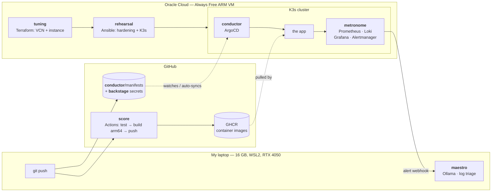
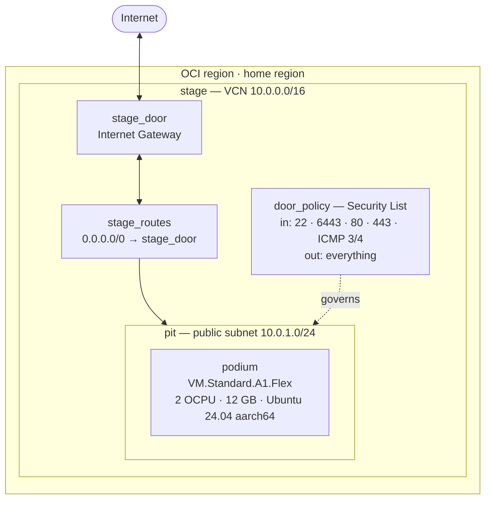

# Architecture

The long version. The [README](../README.md) is the tour; this is where the
decisions get argued rather than stated.

Written incrementally — each layer gets its section as it's built, so this file
tracks the real state of the repo rather than an aspirational one.

**Built so far:** layer 1 (`tuning`).

---

## The one idea underneath everything: nobody touches the machine

Every boundary in this repo comes from one rule. **No layer changes the state of
the system by having a human run something against it.** A layer describes what
should be true and something else makes it true.

- `tuning` doesn't create a VM. It describes a VM that exists, and Terraform
  reconciles.
- `rehearsal` doesn't install packages. It asserts packages are present, and
  Ansible does nothing if they already are.
- `conductor` doesn't deploy. It watches a Git directory and makes the cluster
  match it.

That's the same property three times, and it's why the tools compose. It also
sets the rule for what goes where: **if a step is imperative, one-shot, and
unversioned, it belongs in the layer below the one you're tempted to put it
in** — or nowhere.

The clearest case is cloud-init. Terraform *can* run arbitrary setup at first
boot via user-data. It's tempting: one file, no second tool. But cloud-init
runs exactly once, isn't re-runnable, and changing it means destroying the VM.
So `tuning` puts one thing in metadata — the SSH key, which has to be there
before anything else can connect — and stops. Everything past "can I log in?"
is `rehearsal`'s, where it's idempotent and can be re-run a hundred times.

---

## Target flow



The two dotted lines are the interesting ones, because they're both *pull*.
ArgoCD isn't pushed to — it watches. The app isn't handed an image — it pulls
one. Nothing outside the cluster holds a credential that can change the cluster.

---

## The seams between layers

A platform is mostly its interfaces. Each arrow above is a contract, and
keeping them narrow is what makes any single layer replaceable.

| From | To | What crosses | Why it's that narrow |
|------|-----|--------------|----------------------|
| `tuning` | `rehearsal` | An IP and a login, as an Ansible inventory file | Ansible could query OCI directly with a dynamic inventory plugin. That would mean a second set of cloud credentials and Ansible knowing something about Oracle. Plain text instead — so swapping OCI for Hetzner touches zero lines of Ansible. |
| `rehearsal` | `conductor` | A working K3s cluster and a kubeconfig | Ansible installs ArgoCD once and then stops existing as far as deployments are concerned. |
| `score` | `conductor` | An image tag in a registry | **This is the important one.** See below. |
| `backstage` | `conductor` | An encrypted file in Git | ArgoCD decrypts at sync time. The plaintext never exists in the repo or in CI. |
| `metronome` | `maestro` | An Alertmanager webhook payload | A JSON POST. `maestro` needs no cluster access and no credentials — it's a consumer of alerts, not a participant in the cluster. |

### `score` builds, `conductor` deploys, and they never meet

The single most load-bearing separation in the repo.

The tempting design is one pipeline: CI builds the image, then runs
`kubectl apply`. It works, it's fewer moving parts, and it's what a lot of
teams do. It's also wrong for three reasons that only show up later:

1. **CI would need cluster credentials.** A `KUBECONFIG` secret in GitHub
   Actions means anyone who can merge a workflow change can run arbitrary
   commands against production. The blast radius of a compromised CI token
   becomes the whole cluster.
2. **The cluster's real state stops being knowable.** With `kubectl apply` from
   CI, what's running is the accumulated result of every pipeline that ever ran.
   Answering "what's deployed right now?" means reading job logs. With GitOps
   the answer is `git log` on the manifests directory.
3. **Rollback stops being a first-class operation.** Re-running an old pipeline
   rebuilds an old image against today's base layers and today's dependencies.
   Reverting a commit and letting ArgoCD reconcile puts back the exact
   previously-running state.

So: `score` has registry credentials and no cluster credentials. `conductor`
runs *inside* the cluster and pulls. The only way to change what's running is
to change Git — which means every deploy has an author, a diff, a timestamp,
and a revert button, for free.

This is the difference between "deploy by running a script" and "deploy by
merging to Git", and it's the whole reason ArgoCD is a layer rather than a
line in a workflow file.

---

## The hosting split

Three execution environments, chosen rather than settled for.

```
laptop  (16 GB, WSL2 capped at 8 GB / 8 threads, RTX 4050)   →  maestro
GitHub  (hosted runners)                                     →  score
OCI     (Always Free ARM VM, 2 OCPU / 12 GB)                 →  everything else
```

**Why not all local?** K3s + ArgoCD + kube-prometheus-stack + Loki fits in 8 GB
if nothing else is running. Nothing else running is not a realistic condition
on the machine I also write code on. More importantly, a cluster that's only up
while my laptop is open can't demonstrate the two things this project is
actually about: GitOps reconciling a drift I introduced yesterday, and an alert
firing at 3am.

**Why not all cloud?** `maestro` wants a GPU. The Always Free tier has no GPU,
and paying for one would defeat the point. Running the model locally is also
the better answer on its own merits — log excerpts are exactly the kind of data
that shouldn't leave the machine by default, and "we run inference on our own
hardware because of data locality" is a real position, not a rationalisation.

**Why GitHub for CI?** Free for public repos, and CI that requires my laptop to
be open isn't CI.

The genuine cost of this split is that there's no single `make up`. Bringing the
whole platform from cold takes three tools in three places. That's a fair trade
for each layer running where it belongs, and it's honest about how real
platforms are actually distributed.

---

## Layer 1 — `tuning`

Full documentation: [tuning/README.md](../tuning/README.md).

### What it provisions



### Decisions worth defending

**2 OCPU / 12 GB, not 4 / 24.** Oracle grants 1,500 OCPU-hours and 9,000
GB-hours a month, which over a ~730-hour month is 2.05 OCPUs and 12.3 GB
running *continuously*. The widely-repeated "4 and 24" figure is what you can
create, not what you can run around the clock for free — do that and you burn
roughly double the grant and get billed. A `precondition` in `main.tf` refuses
to plan anything larger unless `enforce_always_free` is explicitly turned off.

**ARM, and the constraint it propagates.** A1 is aarch64. That decision reaches
`score` (must build `linux/arm64` or images die with `exec format error` on
pull), `metronome` (Helm charts need arm64 image tags), and every prebuilt
binary the platform installs. Handled explicitly in each layer rather than
discovered by accident. The x86 alternative — 2× `E2.1.Micro` at 1 GB RAM each —
can't run this stack at all.

**A dedicated route table and security list, not edits to the VCN defaults.**
Terraform can cleanly delete something it created. A "default" object it merely
modified has no delete — it gets orphaned in whatever state the last apply left
it. Owning the objects outright is what makes `terraform destroy` genuinely
complete, which matters on a free tier where leftovers consume quota.

**Security lists, not NSGs.** NSGs attach to VNICs and can reference each other,
which is the better tool once there's real tiering to express. With one subnet
and one instance a security list keeps the whole policy readable in one place
instead of being a property of the compute resource.

**The ICMP type 3 code 4 rule is not optional.** It's Path MTU Discovery. Omit
it and small packets work perfectly — SSH connects, ping succeeds — while
anything large hangs forever with nothing in any log. `apt update` stalls at
0%, `docker pull` freezes mid-layer. OCI's own default security list includes
it; people writing their own leave it out and lose an evening.

**Local state.** One operator, one machine. The problems remote state solves
don't exist yet, and an Object Storage backend introduces a bootstrapping
problem — who provisions the bucket Terraform stores its state in? The migration
path (OCI's S3-compatible endpoint, with the AWS-specific preflight checks
disabled) is written out in `versions.tf` so the choice is documented rather
than defaulted into.

**Ephemeral public IP.** It survives stop/start but not instance recreation. A
reserved IP would survive both. Not worth it while `rehearsal` is a single
command away from reconfiguring a rebuilt node — and the day there's DNS
pointing at this, that calculus changes.

### Two firewalls, and the trap

OCI security lists are enforced in the virtual network, before packets reach
the machine. Ubuntu's OCI image *also* ships with iptables rules rejecting
almost everything except port 22.

Both have to allow a port for it to work. Opening 6443 in the security list and
watching `kubectl` time out anyway is the classic OCI first-day experience — the
console clearly shows the port open. The in-guest half is `rehearsal`'s job, and
it's the first thing layer 2 has to get right.

---

## Layers 2–7

Not built yet. Each gets a section here as it lands, with the same
decisions-worth-defending treatment.

Known constraints already carried forward from layer 1:

- **`rehearsal`** must reconcile the in-guest iptables rules, not just install a
  firewall on top of them. It also needs to verify the root filesystem actually
  grew to the 100 GB boot volume rather than assume it.
- **`score`** must build `linux/arm64`.
- **`metronome`** has 12 GB total to share with everything else, so retention
  and scrape intervals are configuration decisions, not defaults.
