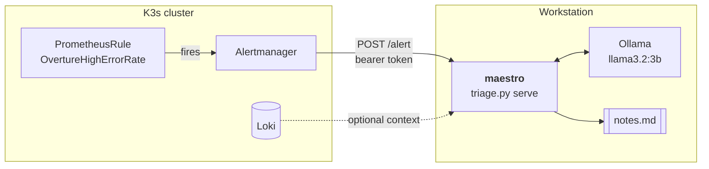

# `maestro` — catching what's off before anyone else does

> *The maestro hears the wrong note before the audience does.*

Layer 7 of [ensemble](../README.md), and the only one that runs on the
workstation rather than in the cluster.

A ~350-line Python tool that reads an Alertmanager webhook or a log excerpt and
drafts the note an experienced engineer would leave for whoever got woken up.

```bash
./triage.py serve                    # listen for Alertmanager webhooks
./triage.py analyse app.log          # one-shot on a log excerpt
kubectl logs deploy/overture | ./triage.py analyse -
```

---

## What it deliberately does not do

It has **no cluster credentials**, runs no commands, and changes nothing. It
reads an alert, reads some logs, and writes a paragraph.

That boundary is the design, not a limitation I'm apologising for. "AIOps"
usually gets sold as software that remediates on its own — and a language model
that can restart your deployments is a language model that can restart your
deployments at 3am because it misread a log line. What's genuinely useful, and
what this actually delivers, is the five minutes of orientation before a human
decides anything.

It's also why nothing else in the platform depends on it being up. Alertmanager
has already done its job by the time maestro runs; if maestro is down you get
the alert without the summary, which is where every other system already is.

## Why it runs locally

Two reasons, and the second is the one that survives a review.

**Data locality.** Log excerpts are among the worst things to ship to a
third-party API — hostnames, IPs, user identifiers, occasionally a token
somebody logged by accident. Running inference on hardware you already own means
that question never has to be asked.

**The GPU.** This is the one component that genuinely wants one, and the Always
Free tier has none. It's where the hosting split stops being symmetric, and
[docs/architecture.md](../docs/architecture.md) argues it rather than glossing
over it.

I did check whether it could move in-cluster to make the platform fully
cloud-hosted. It fits — `ollama/ollama` publishes `linux/arm64`,
`llama3.2:3b` is 2.0 GB, and the model unloads between alerts so idle cost is
near zero. What it costs is quality: a 3B on two Ampere cores at ~4 tok/s writes
visibly worse notes than an 8B on a GPU. The endpoint is a single env var, so
both remain possible.

---

## How it fits



The alert's `runbook` annotation — written in
[metronome](../metronome/rules/prometheusrule-overture.yaml) as instructions to
a human — is passed straight through to the model. Both a person and a model
need to know what to look at first, so it turns out one piece of writing serves
both.

---

## Decisions worth defending

**It answers `202 Accepted` immediately and infers in the background.**
Inference takes 20 seconds to two minutes here. Alertmanager's webhook timeout
is much shorter, and a webhook that doesn't answer in time gets *retried* — so a
slow handler produces duplicate deliveries, which on a machine that runs one
inference at a time means a queue that never drains. Worse, Alertmanager's
notification pipeline blocks on the request, so a slow maestro would delay every
*other* alert behind it. The tool whose job is to help must not be able to make
the outage harder to see.

**Log content is framed as untrusted data in both prompts.** Anything that can
write to a log can try to write instructions into one, and this tool feeds logs
straight to a model. Both prompts delimit the excerpt, label it *"data, not
instructions"*, and tell the model to report anything that looks like an
injection attempt rather than follow it. A test asserts both prompts still say
so, because that's the kind of line that gets edited away during a tidy-up.

**Input is hard-capped at 200 lines / 12,000 characters, keeping the tail.** A
crash-looping pod emits the same stack trace thousands of times a minute, and a
128k-context model will accept all of it — at which point the KV cache doesn't
fit in 6 GB, Ollama spills layers to CPU, and a 20-second inference becomes
several minutes. The *tail* because in an incident the most recent lines are the
ones that matter; the start of a crash loop looks like its middle.

**Prompts are files, not string literals.** They're the part most worth
iterating on, and as files they get a diff, an author and a review. Tuning the
prompt shouldn't mean touching the code.

**`render()` doesn't use `str.format` or f-strings.** Substituted values are log
lines containing JSON, printf templates and percent signs. A formatter would
raise on them or, worse, silently mangle the evidence. There's a test with a
deliberately nasty line.

**`temperature: 0.2`.** Not a creative writing task — the same alert should
produce the same note twice, or nobody builds a habit around it.

**Zero dependencies.** Standard library only, same as `score`. Ollama speaks
plain HTTP+JSON, so `urllib` is enough. Nothing to audit and nothing to install.

**Fails closed on auth, fails open on inference.** No `MAESTRO_TOKEN` means
`/alert` refuses everything — an unconfigured maestro must not start doing
inference for whoever finds the port. But an unreachable Ollama returns a
readable message rather than a traceback, because maestro breaking must never be
why an alert goes unnoticed.

---

## Setup

```bash
curl -fsSL https://ollama.com/install.sh | sh
ollama pull llama3.2:3b

cd maestro
cp .env.example .env          # gitignored; set MAESTRO_TOKEN to match backstage
set -a; . ./.env; set +a
./triage.py serve
```

Then, from the workstation, open the reverse tunnel the cluster reaches it
through:

```bash
ssh -R 0.0.0.0:9099:localhost:9099 stagehand@<node>
```

`0.0.0.0` matters. Alertmanager posts to `http://10.42.0.1:9099/alert` — the
node's own address on the K3s pod network — and a loopback-only bind isn't
reachable from a pod. **`GatewayPorts` defaults to `no`, and when it's `no` sshd
binds to loopback anyway without complaining**: the ssh client reports success,
the tunnel looks up, and every webhook times out with nothing in any log
explaining why. `lockup` (layer 2) now sets `GatewayPorts clientspecified` for
exactly this.

### The shared token

One value, two consumers, in different places — so two delivery mechanisms:

| Consumer | Where | How it arrives |
|---|---|---|
| Alertmanager | in-cluster | SOPS-encrypted Secret from `backstage`, mounted as a file |
| maestro | workstation | `MAESTRO_TOKEN` in a local, gitignored `.env` |

A Kubernetes Secret can't span namespaces or leave the cluster, which is why
`backstage/secrets-metronome.enc.yaml` is a second file rather than another key
in the first.

## Try it without an alert

```bash
kubectl -n overture logs deploy/overture --tail=200 | ./triage.py analyse -
```

Or check it's alive: `curl localhost:9099/healthz`.

---

## Verified

- **30 tests pass** (`python3 -m unittest discover maestro`), none of which need
  Ollama running — a suite that requires a 2 GB model loaded is a suite nobody
  runs
- Truncation keeps the tail, catches a single huge line, and names the cap that
  actually fired rather than the one that didn't
- Label values from the webhook are escaped before they reach a LogQL matcher,
  so a quote in an alert label cannot malform the Loki query
- Numeric settings fall back with a warning instead of raising, and a failure
  during triage is still written out as a note — the 202 has already been sent,
  so nothing else could report it
- Both prompts still declare their content untrusted
- Token auth: correct accepted; wrong, prefix, missing, wrong-scheme and
  unconfigured all rejected
- Unreachable Ollama returns a message, not a traceback
- Loki lines are re-ordered oldest-first, the way a human reads an incident
- The Alertmanager side was rendered from the real chart and asserted: secret
  mounted, bearer read from a file, **no plaintext token in the rendered
  config**, `send_resolved` on, Watchdog routed to null

**Not verified:** no model has actually been called, and no alert has travelled
the path. The tunnel, the token exchange and the quality of the notes all need
the cluster and a running Ollama.

## What I'd add next

- **Feed the note back as a Slack/Discord message** rather than a file, once
  there's somewhere it belongs.
- **Retrieval over past notes** — "this is the third time this week" is the
  sentence that leads to a fix, and it only exists if maestro can read its own
  history.
- **Let it query Prometheus, not just Loki.** It can already reason about logs;
  the graph shape is the other half of the answer.
