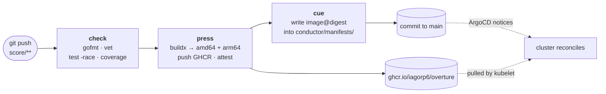

# `score` — what gets built, and how

> *Everyone follows the score. Nobody improvises the deployment.*

Layer 3 of [ensemble](../README.md). A small Go service (`overture`) and the
pipeline that tests it, builds a multi-architecture image, publishes it to GHCR,
and tells `conductor` about it.

---

## One structural note up front

The brief for this project put the workflow at `score/.github/workflows/score.yml`.
That file would never run. **GitHub Actions only reads workflows from
`.github/workflows/` at the repository root**, and nothing warns you — the
Actions tab is simply empty and the pipeline appears to be broken for no reason.

So the workflow lives at [`.github/workflows/score.yml`](../.github/workflows/score.yml)
and everything else this layer owns lives here. The layer is still one
directory; only that one file has to sit where GitHub can see it.

---

## The pipeline



Three jobs, each with the narrowest permissions that work:

| Job | Permissions | Can it reach the cluster? |
|---|---|---|
| `check` | `contents: read` | No |
| `press` | `packages: write`, `id-token: write` | No |
| `cue` | `contents: write` | **No** |

**Nothing in this pipeline has cluster credentials.** No `KUBECONFIG` secret, no
`kubectl`, no cloud login. It can push an image and it can commit to this
repository — that is the whole of its authority.

That's the separation layer 4 exists to enforce, seen from the other side. A
`KUBECONFIG` secret here would mean anyone who can merge a change to a workflow
file can run arbitrary commands against production, and workflow files get
edited far more casually than infrastructure does.

---

## The interesting problem: building for a machine you aren't

Layer 1 provisions an Ampere A1 instance — **aarch64**. GitHub's hosted runners
are **x86_64**. Every image this pipeline produces has to target a machine the
builder isn't.

There are two ways, and the difference is not small.

**Emulation.** Register QEMU via `docker/setup-qemu-action`, then run the whole
build stage under emulated aarch64. It works, and it's what nearly every
multi-arch tutorial shows. It's also **10–20× slower**, because every
instruction of the compiler is being interpreted.

**Cross-compilation.** Run the build stage *natively* on the runner and tell the
compiler to emit code for the target. Go does this with two environment
variables, because its standard library ships precompiled for every supported
platform.

This pipeline takes the second option, and one line selects it:

```dockerfile
FROM --platform=$BUILDPLATFORM golang:1.26-alpine AS build
```

`$BUILDPLATFORM` pins that stage to the *builder's* architecture. Without it,
BuildKit helpfully runs the stage as aarch64 under QEMU — and **the build still
succeeds**, just slowly. That's why the mistake is easy to miss: it isn't an
error, it's a bill.

The runtime stage needs no emulation either, because nothing executes in it —
the arm64 base is pulled and a file is copied in. So
[`score.yml`](../.github/workflows/score.yml) never installs QEMU at all, and
the conspicuous absence of `docker/setup-qemu-action` is deliberate.

**This is the main reason `overture` is written in Go.** A Python or Node
service would need dependencies installed *for the target architecture*, which
means either emulation or a cross-build toolchain, and the pipeline gets
meaningfully harder for a demo app.

Measured locally with Go 1.26 (the exact build the Dockerfile runs):

```
linux/amd64   6,144,162 bytes   statically linked
linux/arm64   5,636,258 bytes   statically linked   ELF 64-bit LSB, ARM aarch64
```

---

## The service

`overture` — the opening piece, and the first workload to travel the whole path:
`score` builds it, GHCR stores it, `conductor` deploys it, `metronome` will
scrape it.

Deliberately small. The interesting part of this layer is the pipeline, not the
app. What it does have is everything the rest of the platform actually needs
from a real service.

| Endpoint | Purpose |
|---|---|
| `GET /` | JSON: name, version, commit, build date, hostname |
| `GET /healthz` | **Liveness** — is this process wedged? |
| `GET /readyz` | **Readiness** — should traffic come here? |
| `GET /metrics` | Prometheus exposition format |

### Zero dependencies

There is no `go.sum`, because there is nothing to check. Everything is standard
library. That buys three things: nothing to audit, a container build that needs
no module download (so it can't be broken by a proxy outage or a yanked
version), and a Prometheus endpoint that had to be *understood* rather than
imported.

A real service would pull in `prometheus/client_golang` and be right to.

### Liveness and readiness are not the same question

Conflating them is one of the most common Kubernetes mistakes, and it's
expensive.

- **Readiness** failing removes the pod from the Service's endpoints. Recoverable, no restart.
- **Liveness** failing **kills the container**.

Pointing a liveness probe at a database is how a thirty-second dependency blip
turns into every replica restarting simultaneously — a brief degradation becomes
an outage. So `/healthz` checks only that this process can still reply.
Dependency checks belong in `/readyz`. There's a test asserting liveness stays
`200` even while the pod is draining, because that property is load-bearing.

### SIGTERM is handled properly, which is not just "catch it and exit"

When a pod terminates, two things happen **concurrently and in no guaranteed
order**: the kubelet sends SIGTERM, and the endpoints controller removes the pod
from its Service. Those propagate at different speeds — kube-proxy on every node
has to update. So for a short window after SIGTERM, traffic is *still being
routed to a pod that has been told to die.*

Exiting immediately drops those requests. That is the single most common source
of the handful of 502s that appear during every rolling update and get written
off as "just a blip".

So `gracefulShutdown` does three things in order: fail readiness (which is what
actually starts the removal), pause for it to propagate, then stop accepting and
drain what's in flight.

### Metric cardinality is guarded by a test

Labelling with the raw URL path turns every distinct URL into its own time
series. One `/users/{id}` endpoint with a million users is a million series, and
unbounded label cardinality is the standard way to take a Prometheus server
down.

The middleware records the **route pattern** instead, and
`TestMetricsLabelUsesRoutePatternNotRawPath` fails if a raw path ever leaks into
a label. Routes here are fixed so it's safe either way — but the habit is the
point, and a test is how a habit survives.

---

## Two different pinning rules, on purpose

| Artifact | Pinned by | Why |
|---|---|---|
| The **app** image, in `conductor/manifests/` | **digest** (`:tag@sha256:…`) | A rollback has to restore the exact bytes that worked. Immutability is the whole point. |
| The **base** image, in the Dockerfile | **tag** (`:nonroot`) | It should absorb security patches. A digest freezes it, and without Renovate opening update PRs, "pinned" quietly becomes "unpatched forever". |

Opposite requirements, different answers. Adding Renovate — noted in the root
README's *what I'd add next* — is what would let the base be pinned too.

---

## Running it locally

```bash
cd score
go test ./...
go run .
```

```bash
curl -s localhost:9898/ | jq
curl -s localhost:9898/metrics | head -20
curl -is localhost:9898/readyz | head -1
```

Build the image the way CI does:

```bash
docker buildx build --platform linux/arm64 -t overture:local score/
```

---

## What `cue` does, and why it isn't a deploy

The `cue` job commits one line to `conductor/manifests/overture/deployment.yaml`:

```yaml
image: ghcr.io/iagorp6/overture:sha-abc1234@sha256:...
```

It does not deploy. ArgoCD is watching that directory *from inside the cluster*
and reconciles on its own. The deploy still happens because Git changed — so it
still has an author, a diff, a timestamp, and a revert.

**Loop prevention is structural, not a marker.** That commit is a push to
`main`, which would normally retrigger this workflow, which would build and
commit again, forever. The `paths:` filter lists only `score/**` and the
workflow file — `conductor/**` is absent, so the bot's own commit cannot
retrigger it. No `[skip ci]` for anyone to forget.

The `sed` is guarded: it asserts the file contains **exactly one** `image:` line
before editing and refuses to guess otherwise, then verifies the new value
actually landed (a `sed` that matches nothing still exits 0).

The alternative is ArgoCD Image Updater, which watches the registry directly and
writes back to Git itself — removing this job and its `contents: write`
permission. Better at scale; this is the more legible version, and the mechanism
is identical.

---

## Before the first run

The image is published to GHCR under your account. **A new package is private by
default**, and the cluster pulls anonymously — so the first deploy will fail
with `ImagePullBackOff` until you either:

- make the package public: GitHub → Packages → `overture` → Package settings →
  Change visibility → Public, **or**
- create a pull secret in the cluster — which is layer 5's (`backstage`)
  territory, since that secret has to get into Git safely.

Until `score` runs for the first time, `conductor` deploys
`ghcr.io/stefanprodan/podinfo` as a placeholder. The first successful `cue`
replaces it.

---

## Verified

- `gofmt`, `go vet`, and **20 passing tests** on Go 1.26
- Cross-compiled to `linux/amd64` and `linux/arm64`; the arm64 output confirmed
  as `ELF 64-bit LSB executable, ARM aarch64, statically linked`
- `actionlint` **with shellcheck enabled**: 0 findings on the workflow
- `hadolint`: 0 findings on the Dockerfile

**Not verified:** no container image was actually built — the Docker daemon
wasn't running — and the workflow has not executed on GitHub. Lint-clean is not
the same as green.
