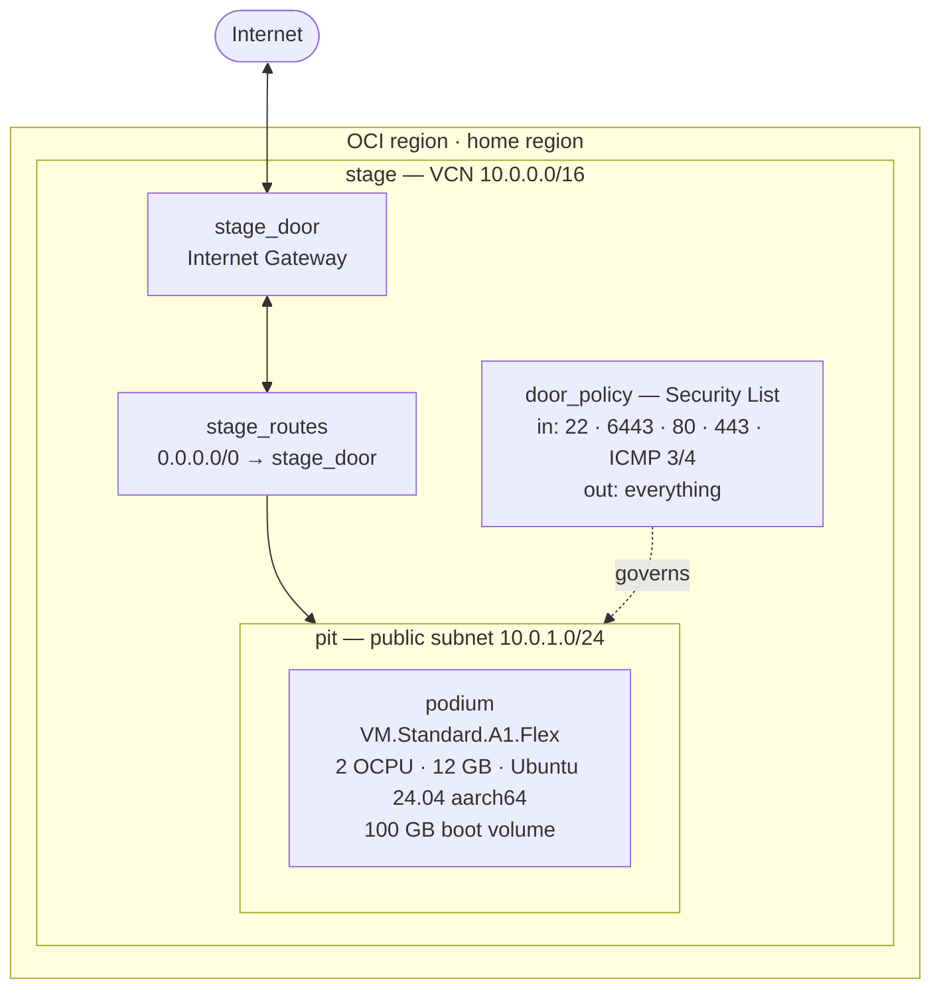

# `tuning` — provisioning the venue

> *An ensemble tunes its instruments before it can do anything else.*

Layer 1 of [ensemble](../README.md). This is the only layer that creates
infrastructure from nothing. Everything after it configures, deploys to, or
observes what gets built here.

It provisions one Oracle Cloud Always Free ARM instance and the network around
it, and hands the next layer an IP address and a way in.

---

## What it builds



Six resources. The names are the orchestra metaphor; each one maps to exactly
one standard cloud concept, and [main.tf](main.tf) names both every time.

| Themed name    | What it actually is        | Why it's there                                        |
| -------------- | -------------------------- | ----------------------------------------------------- |
| `stage`        | Virtual Cloud Network      | The private network everything lives inside            |
| `stage_door`   | Internet Gateway           | The way in and out                                     |
| `stage_routes` | Route Table                | "Anything not local goes to the gateway"               |
| `door_policy`  | Security List              | Which ports are open to whom                           |
| `pit`          | Public subnet              | The slice of network the node's NIC attaches to        |
| `podium`       | Compute instance           | The machine itself                                     |

---

## Prerequisites

You need three things before `terraform apply` will do anything: Terraform
installed, an SSH keypair, and OCI API credentials.

### 1. Terraform

Everything in this project after layer 1 needs a Linux shell (Ansible has no
supported Windows control node), so do all of it inside WSL and keep one
toolchain rather than two. The repo on the Windows filesystem is reachable
from WSL at `/mnt/c/Users/<you>/Documents/Code/ensemble` — that works fine.

```bash
wget -O - https://apt.releases.hashicorp.com/gpg | sudo gpg --dearmor -o /usr/share/keyrings/hashicorp-archive-keyring.gpg
echo "deb [signed-by=/usr/share/keyrings/hashicorp-archive-keyring.gpg] https://apt.releases.hashicorp.com $(lsb_release -cs) main" | sudo tee /etc/apt/sources.list.d/hashicorp.list
sudo apt update && sudo apt install -y terraform
terraform version
```

You want 1.9 or newer — [versions.tf](versions.tf) requires it, because the
free-tier guardrails use cross-variable validation that older versions can't
parse.

### 2. An SSH keypair

```bash
ssh-keygen -t ed25519 -C "ensemble" -f ~/.ssh/ensemble_ed25519
```

Ed25519 over RSA: shorter keys, faster, and no key-size decision to get wrong.

Keep this inside the WSL home directory, not on `/mnt/c`. The Windows
filesystem doesn't carry Unix permission bits reliably, and SSH refuses to use
a private key it thinks is world-readable.

The public half (`ensemble_ed25519.pub`) is what Terraform reads and injects
into the VM at first boot. **The private half is never read by Terraform and
must never be committed.** Point `ssh_public_key_path` at the `.pub` file in
your `terraform.tfvars`.

This key is the only way into the machine. There's no password, and OCI has no
password reset for a VM — if this goes wrong the recovery path is detaching the
boot volume and mounting it on a second instance.

### 3. OCI API credentials

OCI doesn't use a bearer token. Every API request is **signed** with an RSA
private key, and Oracle verifies the signature against a public key you upload
to your user profile. So: generate a keypair, give Oracle the public half, tell
Terraform where the private half is.

```bash
mkdir -p ~/.oci && chmod 700 ~/.oci
openssl genrsa -out ~/.oci/oci_api_key.pem 2048
chmod 600 ~/.oci/oci_api_key.pem
openssl rsa -pubout -in ~/.oci/oci_api_key.pem -out ~/.oci/oci_api_key_public.pem
cat ~/.oci/oci_api_key_public.pem
```

In the OCI Console: **Profile → My profile → API keys → Add API key → Paste a
public key**, and paste what `cat` printed.

The console then shows you a config preview containing your tenancy OCID, user
OCID, fingerprint and region. Copy it into `~/.oci/config`:

```ini
[DEFAULT]
user=ocid1.user.oc1..aaaaaaaa...
fingerprint=aa:bb:cc:dd:...
tenancy=ocid1.tenancy.oc1..aaaaaaaa...
region=sa-saopaulo-1
key_file=/home/<you>/.oci/oci_api_key.pem
```

```bash
chmod 600 ~/.oci/config
```

Use an absolute path for `key_file`. Some OCI tooling doesn't expand `~`, and
the resulting error says the key is missing rather than that the path is odd.

Note that this is a **different key** from the SSH key in step 2. The API key
proves to Oracle that Terraform may create resources; the SSH key gets you into
the machine those resources produce. Two keys, two jobs, no overlap.

### 4. Your variables

```bash
cd tuning
cp terraform.tfvars.example terraform.tfvars
```

Fill in `tenancy_ocid` — it's the `tenancy=` line you just pasted into
`~/.oci/config`. Everything else has a working default.

---

## The concepts underneath this

Written out because the point of this repo is being able to explain it, not
just run it.

### Desired state, not instructions

`main.tf` isn't a script. It never says "create a VCN" — it says "a VCN with
these properties exists." Terraform's job is to compare that description to
reality and work out the difference.

That's what makes it re-runnable. Run `apply` twice and the second one does
nothing, because reality already matches. Delete the instance in the console
and run again and it comes back. There's no "already exists" error to handle,
because existence isn't an event, it's a condition being checked.

This is the same property that makes `rehearsal` (layer 2) idempotent, and the
same one that makes `conductor` (layer 4) a GitOps controller rather than a
deploy script. Three different tools, one idea: describe the destination and
let something else work out the route.

### Resources vs data sources

A `resource` block is something Terraform **owns** — creates, updates, destroys.
A `data` block only **reads**. Terraform will never modify what a data source
touches, and it re-reads them on every plan, so they always reflect current
reality.

This layer uses two data sources: the availability domain list, and the Ubuntu
image catalogue. Neither is anything I created; both are facts about OCI I need
in order to build.

### State

Terraform keeps a JSON file mapping every resource in the config to the real
object it created — `oci_core_instance.podium` is `ocid1.instance.oc1...`.
That's state, and it's the thing that lets Terraform tell "create this" apart
from "this exists already, leave it."

Three things follow, and all three are why it's the first entry in
[.gitignore](../.gitignore):

- **It can contain secrets.** Some resource types write generated passwords and
  keys into state in plaintext, whether or not they appear in your `.tf` files.
- **Losing it means losing control, not losing the resources.** The VM keeps
  running. Terraform just no longer knows it exists, so `destroy` won't remove
  it and `apply` will try to build a second one.
- **It's an index, not a backup.** It records what was built, not how.

State here is a local file, deliberately — the reasoning, and the OCI Object
Storage backend you'd move to with a second engineer, is written out at length
in [versions.tf](versions.tf).

### The dependency graph is implicit

Nothing in `main.tf` declares an ordering. Terraform derives it: the subnet
references `oci_core_vcn.stage.id`, so the VCN must exist first. The instance
references the subnet, so it comes after that.

Everything with no dependency between it gets built **in parallel**. This is
why a failed apply is usually safe to just re-run — the graph is recomputed
against current reality, and whatever succeeded last time is simply skipped.

---

## The Always Free maths — the thing worth knowing

The defaults here are 2 OCPU and 12 GB RAM. Nearly every tutorial online says
4 and 24. Those tutorials will cost you money.

Oracle doesn't grant you a machine size. It grants a **monthly budget**:

```
1,500 OCPU-hours/month  and  9,000 GB-hours/month  on VM.Standard.A1.Flex
```

An average month is about 730 hours. So what you can run **continuously** for
free is:

```
1,500 ÷ 730 = 2.05 OCPUs
9,000 ÷ 730 = 12.33 GB
```

A 4 OCPU / 24 GB instance is creatable — the console will happily let you — and
running it around the clock burns 2,920 OCPU-hours and 17,520 GB-hours. Roughly
double the grant. Oracle bills the difference. It's "free" only if you run it
about half the month.

So the defaults are 2 and 12, and
[main.tf](main.tf) carries a `precondition` that refuses to plan anything
larger unless you flip `enforce_always_free = false` on purpose. Guardrails in
code, checked before any API call, rather than a warning in a README.

Two OCPUs is enough. Ampere cores aren't hyperthreaded, so 2 OCPU is 2 real
cores, and 12 GB comfortably fits K3s, ArgoCD, Prometheus, Loki, Grafana and a
small app — provided layer 6 gets configured with retention limits rather than
chart defaults. That constraint is a feature: tuning an observability stack to
fit a real budget is a more useful thing to have practised than running it with
everything at default on a machine that never fills up.

Storage is simpler: **200 GB total** across all boot and block volumes, and
boot volumes are not exempt. 100 GB here is half the grant on purpose.

---

## The ARM decision, and everything it touches

`VM.Standard.A1.Flex` is Ampere — **aarch64, not x86_64**. That's not a detail
local to this file. It's a decision about the whole platform:

- **`score` (layer 3)** must build `linux/arm64` images. An x86 image built by
  a default GitHub Actions runner will pull onto this node and die with `exec
  format error`. That means `docker/setup-qemu-action` plus
  `docker/build-push-action` with an explicit platform.
- **`metronome` (layer 6)** needs Helm charts whose images publish arm64 tags.
  The mainstream ones do. Smaller exporters sometimes don't, and finding out at
  `helm install` time is annoying.
- **Anything pulled as a prebuilt binary** — K3s, ArgoCD CLI, SOPS, age — needs
  the arm64 build.

The alternative was 2× `VM.Standard.E2.1.Micro` (x86, 1 GB RAM each). That
sidesteps all of it and cannot run this stack; 1 GB doesn't hold K3s plus a
Prometheus. So: ARM, and the arm64 constraint gets handled explicitly in each
later layer rather than discovered by accident.

---

## Running it

```bash
cd tuning
terraform init
```

`init` downloads the OCI provider and writes `.terraform.lock.hcl` — the
resolved versions plus checksums. **Commit that lockfile.** It's what makes a
fresh clone build the same thing.

```bash
terraform plan
```

Read the output. `plan` makes no changes; it prints exactly what `apply` would
do. The free-tier precondition is evaluated here, so a config that would cost
money fails at this step, before anything exists.

```bash
terraform apply
```

Type `yes` at the prompt. Expect two to five minutes.

Then hand the results to layer 2:

```bash
terraform output
terraform output -raw ansible_inventory > ../rehearsal/inventory.ini
ssh ubuntu@$(terraform output -raw node_public_ip)
```

The default user on OCI's Ubuntu images is `ubuntu` — not `root`, and not `opc`
(that one's Oracle Linux).

---

## When apply fails

### `Out of host capacity`

By far the most common one, and it isn't your config. Free-tier Ampere capacity
is genuinely scarce in popular regions, and Oracle serves paying customers
first.

- If your region has more than one availability domain, set
  `availability_domain_index = 1` (then `2`) and retry. Capacity is tracked
  per-AD.
- Otherwise it's a retry loop. Capacity frees up unpredictably; people run a
  retry every few minutes and get in overnight.
- Upgrading the account to Pay As You Go makes A1 capacity dramatically more
  available and **keeps Always Free resources free** — you're billed only for
  what exceeds the grant, which with this config is nothing. It does mean a
  card on file and a real bill if you later exceed the limits, so it's a
  judgement call rather than an obvious yes.

Nothing partial is left behind: the network gets built and the instance
doesn't, and re-running `apply` picks up exactly where it stopped.

### `NotAuthenticated` / `401`

The signing chain is wrong somewhere. Check in this order: the fingerprint in
`~/.oci/config` matches the one the console shows for that API key; `key_file`
is an absolute path; the key file is the **private** `.pem`, not the public one;
`chmod 600` on both the key and the config.

### `LimitExceeded` / `QuotaExceeded`

Something already exists that's consuming the grant. Usually an old instance,
or — more often — an **orphaned boot volume** from an instance deleted through
the console without its volume. Check Console → Storage → Block Volumes.
`preserve_boot_volume = false` in [main.tf](main.tf) is there to stop this
repo creating that problem.

### `The requested shape is not supported`

That shape isn't offered in your region or AD. A1 isn't in every region.

---

## What this hands to `rehearsal`

The seam between layer 1 and layer 2 is deliberately narrow — an address and a
login, nothing else:

```ini
[ensemble]
podium ansible_host=<public ip>

[ensemble:vars]
ansible_user=ubuntu
ansible_python_interpreter=/usr/bin/python3
ansible_ssh_private_key_file=/home/<you>/.ssh/ensemble_ed25519
```

Ansible could have queried OCI itself with a dynamic inventory plugin. It
doesn't, on purpose: that would mean a second set of cloud credentials, a
plugin to install and debug, and Ansible knowing something about Oracle. Instead
Terraform states what it already knows and Ansible reads plain text.

**Terraform owns what exists. Ansible owns what's configured on it.** Neither
reaches into the other, which is what would let this layer be swapped for
Hetzner or a bare-metal box without touching a line of Ansible.

---

## Tearing it down

```bash
terraform destroy
```

Removes all six resources. Because `preserve_boot_volume = false`, the 100 GB
boot volume goes with the instance instead of quietly sitting in your storage
grant.

Worth doing between working sessions if you're near the free-tier line. Worth
*not* doing once layer 2 has configured the node, since rebuilding means
re-running `rehearsal` — which is exactly the situation idempotent configuration
management exists for, and a fine excuse to prove it works.

---

## Verified

`soundcheck` runs these on every push, and they pass:

- `terraform fmt -check -recursive -diff`, clean
- `terraform init -backend=false` then `terraform validate` against the real OCI
  provider, so the resource schemas are checked rather than assumed
- The **14 `validation` blocks in `variables.tf`**, which are what keep the
  free-tier envelope honest. They fail at plan time with a sentence, which is
  the point of putting a guardrail in code instead of in this file.

**Not verified:** no instance has ever existed. `terraform apply` has not run, so
A1 capacity behaviour, cloud-init, the SSH path, and the `ansible_inventory`
output that `rehearsal` consumes are all unproven. Everything above says the
configuration is well-formed and self-limiting. None of it says Oracle accepted
it.
